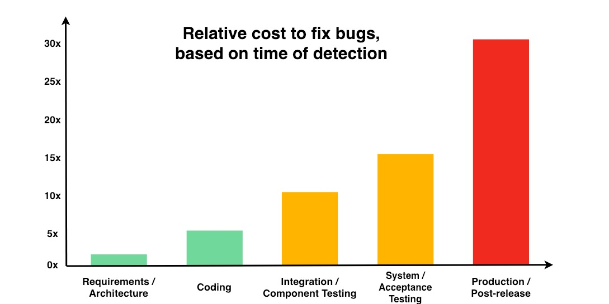
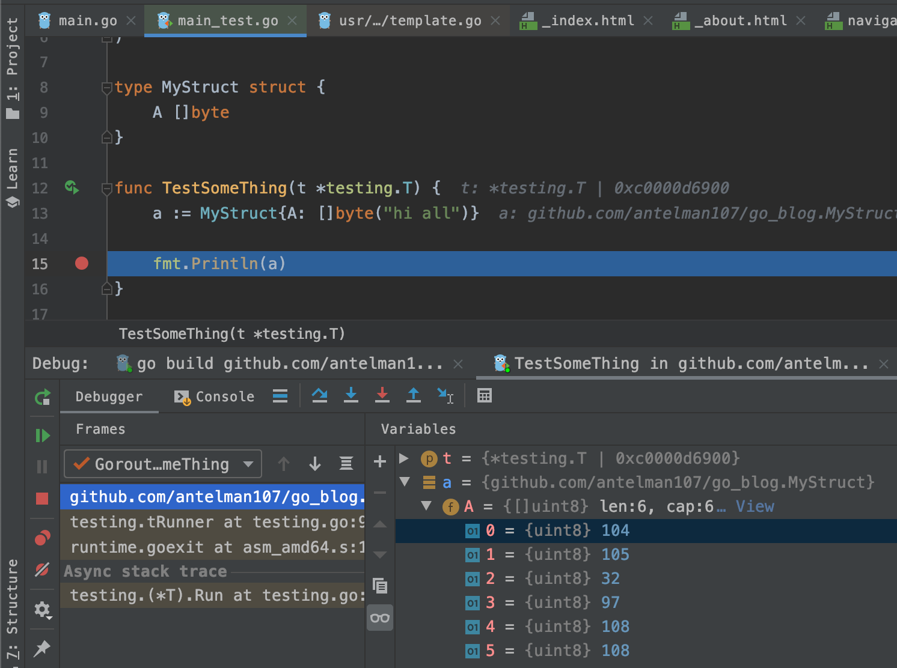

+++
title = 'Как и зачем использовать дебаггер с GO'
date = 2020-03-24T09:00:00+03:00
draft = false
tags = ['debugger', 'goland']
url = '/ru/post/goland-debugger.html'

[quiz]
  [[quiz.questions]]
    question = "Что такое отладчик?"
    type = "single-choice"
    [[quiz.questions.answers]]
      text = "Инструмент для отладки кода, который позволяет устанавливать точки останова и отслеживать состояние программы"
      correct = true
    [[quiz.questions.answers]]
      text = "Язык программирования"
      correct = false
    [[quiz.questions.answers]]
      text = "Система управления базами данных"
      correct = false
  
  [[quiz.questions]]
    question = "Какое главное преимущество использования отладчика?"
    type = "single-choice"
    [[quiz.questions.answers]]
      text = "Вы можете отлаживать код без его изменения"
      correct = true
    [[quiz.questions.answers]]
      text = "Он делает ваш код быстрее"
      correct = false
    [[quiz.questions.answers]]
      text = "Он автоматически исправляет ошибки"
      correct = false
  
  [[quiz.questions]]
    question = "Что происходит, когда достигается точка останова в GoLand?"
    type = "multiple-choice"
    [[quiz.questions.answers]]
      text = "Программа останавливается в этой точке"
      correct = true
    [[quiz.questions.answers]]
      text = "Вы можете видеть стек вызовов"
      correct = true
    [[quiz.questions.answers]]
      text = "Вы можете просматривать переменные"
      correct = true
    [[quiz.questions.answers]]
      text = "Все горутины продолжают выполняться"
      correct = false
+++

Отладчик — это очень полезный и мощный инструмент. Он может помочь вам точно понять, что происходит в вашем коде, изучить новые проекты и избежать ненужных изменений отладочного кода.

<!--more-->

Время, необходимое для исправления любой проблемы, зависит от этапа, на котором она обнаружена:

Лучший способ исправить любую проблему — исправить её до написания кода (на этапе планирования).
Но если у нас уже есть ошибка в коде, лучше разобраться с ней на этапе разработки.

Таким образом, чем раньше мы исправляем ошибки, тем эффективнее мы как разработчики и как команда.

Отладчик здесь чрезвычайно полезен.
Это очень распространённый инструмент во многих языках программирования, но мне кажется, что Go-разработчики его не используют.
Я опишу, почему он полезен и почему рекомендую использовать его на примерах в IDE GoLand.

## Что такое отладчик?

Отладчик — это всё о точках останова.
Вы устанавливаете точки, где хотите, чтобы ваша программа остановилась, чтобы вы могли отслеживать состояние программы.

Сначала вы устанавливаете точку останова:

Программа остановится _перед_ выбранной вами строкой.

Затем вы запускаете свою программу или тест, и она останавливается:

С левой стороны панели отладки вы можете видеть стек вызовов (все функции, вызванные до достижения точки останова).
Этот след очень информативен, если вы изучаете новый репозиторий и хотите понять, выполняется ли определённый код и какие другие инструкции задействованы. Да, в GoLand есть инструменты использования функций. Вы можете увидеть все случаи использования любой функции, но это может занять время, потому что вам нужно будет проверить множество использований функций, пока вы не найдёте main.go.
Отладчик просто показывает вам полный след.
С правой стороны вы можете видеть любые переменные, доступные в области видимости точки останова.
На левой панели инструментов есть кнопки для перемещения между точками останова.

## Зачем использовать отладчик?

### 1. Без изменений кода

Чтобы увидеть, что происходит в программе, вам не нужно добавлять какой-либо отладочный код (`fmt.Print` и т.д.).
Если вы решите добавить отладочный код, этот код будет находиться в тех же файлах, которые вы хотите отладить, поэтому он может быть во всех возможных файлах проекта. Нет способа отделить, какой код предназначен для отладки, а какой — для продакшена. Вам придётся вручную проверять все внесённые изменения перед коммитом, чтобы найти и удалить отладочный код. И даже после этого высока вероятность отправить отладочный код в репозиторий (это ошибка, которую вы не хотите допустить).

### 2. Простой способ изучить переменные любого типа

Представление переменных в отладчике также намного более удобно для пользователя, чем любой вывод, который вы можете запрограммировать для перечисления переменных.
Например, посмотрите, как просто просмотреть любые сложные структуры или списки:

Вы можете видеть массив байтов, созданный из строки, а также можете увидеть его как текст, нажав на ссылку "View".
Сколько времени вы потратите, пытаясь отобразить эти данные? Это не будет одна строка кода, и этот код зависит от типа переменной, которую вы хотите изучить. Отладчик элегантно отображает любую переменную.

## Недостатки

Отладчик изменяет поведение программы.
Go известен своими паттернами конкурентности, поэтому у вас, вероятно, много горутин в вашей программе. Точка останова устанавливается в коде, который относится к одной или некоторым из всех горутин, но то, что происходит в других горутинах, — это ответственность отладчика. В GoLand все горутины останавливаются. Но могут быть ситуации, когда вы хотите собрать отладочные данные, но не хотите, чтобы программа останавливалась. В этом случае вам всё равно придётся получить эту отладочную информацию без отладчика.

Это в основном всё по текущей теме.
Не стесняйтесь комментировать этот пост здесь на сайте или присоединяйтесь к нашей телеграм-группе.