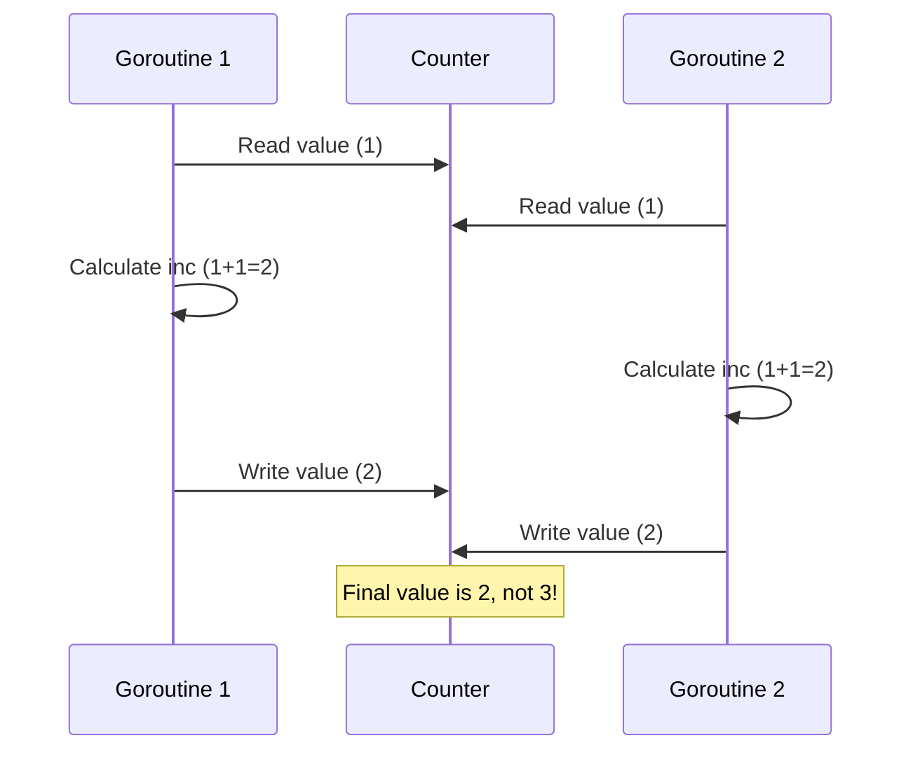

+++
title = 'Data handling in concurrent programs'
date = 2020-04-02T09:00:00+03:00
draft = false
tags = ['map', 'sources']
featured_image = 'kanat.svg'
url = '/en/post/golang-data-handling-concurrent-programs.html'

[quiz]
  [[quiz.questions]]
    question = "What happens when multiple goroutines increment a counter variable without synchronization?"
    type = "single-choice"
    [[quiz.questions.answers]]
      text = "The counter value will be less than expected due to race conditions"
      correct = true
    [[quiz.questions.answers]]
      text = "The program will panic"
      correct = false
    [[quiz.questions.answers]]
      text = "The counter will always be correct"
      correct = false
  
  [[quiz.questions]]
    question = "What error occurs when multiple goroutines write to a map concurrently?"
    type = "single-choice"
    [[quiz.questions.answers]]
      text = "panic: concurrent map writes"
      correct = true
    [[quiz.questions.answers]]
      text = "The map will be empty"
      correct = false
    [[quiz.questions.answers]]
      text = "No error, but incorrect results"
      correct = false
  
  [[quiz.questions]]
    question = "What are the solutions for thread-safe counter operations?"
    type = "multiple-choice"
    [[quiz.questions.answers]]
      text = "Using `sync.Mutex`"
      correct = true
    [[quiz.questions.answers]]
      text = "Using channels"
      correct = true
    [[quiz.questions.answers]]
      text = "Using atomic package"
      correct = true
    [[quiz.questions.answers]]
      text = "Using regular variables"
      correct = false
  
  [[quiz.questions]]
    question = "How can you detect data races in Go programs?"
    type = "single-choice"
    [[quiz.questions.answers]]
      text = "Using go test -race or go build -race"
      correct = true
    [[quiz.questions.answers]]
      text = "Using go vet"
      correct = false
    [[quiz.questions.answers]]
      text = "Using gofmt"
      correct = false
  
  [[quiz.questions]]
    question = "What happens when writing to a slice concurrently without synchronization?"
    type = "single-choice"
    [[quiz.questions.answers]]
      text = "The number of elements will be less than expected due to data races"
      correct = true
    [[quiz.questions.answers]]
      text = "The program will panic"
      correct = false
    [[quiz.questions.answers]]
      text = "The slice will always contain all elements"
      correct = false
  
  [[quiz.questions]]
    question = "Why is the increment operation (c++) not atomic?"
    type = "single-choice"
    [[quiz.questions.answers]]
      text = "It consists of three steps: read, increment, write"
      correct = true
    [[quiz.questions.answers]]
      text = "Go doesn't support atomic operations"
      correct = false
    [[quiz.questions.answers]]
      text = "The operation is always atomic"
      correct = false
  
  [[quiz.questions]]
    question = "What is the difference between sync.Mutex and sync.RWMutex?"
    type = "single-choice"
    [[quiz.questions.answers]]
      text = "RWMutex allows parallel reads, Mutex blocks all operations"
      correct = true
    [[quiz.questions.answers]]
      text = "RWMutex is faster than Mutex"
      correct = false
    [[quiz.questions.answers]]
      text = "There is no difference"
      correct = false
  
  [[quiz.questions]]
    question = "Why are channel operations atomic?"
    type = "single-choice"
    [[quiz.questions.answers]]
      text = "It's built-in Go functionality"
      correct = true
    [[quiz.questions.answers]]
      text = "Channels use Mutex internally"
      correct = false
    [[quiz.questions.answers]]
      text = "Channels work only in one goroutine"
      correct = false
  
  [[quiz.questions]]
    question = "What functions does the atomic package provide for working with counters?"
    type = "multiple-choice"
    [[quiz.questions.answers]]
      text = "AddInt32"
      correct = true
    [[quiz.questions.answers]]
      text = "AddInt64"
      correct = true
    [[quiz.questions.answers]]
      text = "LoadInt32"
      correct = true
    [[quiz.questions.answers]]
      text = "SetInt32"
      correct = false
  
  [[quiz.questions]]
    question = "How does the race detector work in Go?"
    type = "single-choice"
    [[quiz.questions.answers]]
      text = "Tracks simultaneous access to the same memory"
      correct = true
    [[quiz.questions.answers]]
      text = "Checks code syntax"
      correct = false
    [[quiz.questions.answers]]
      text = "Analyzes performance"
      correct = false
  
  [[quiz.questions]]
    question = "What is the 'loop closure' problem in goroutines?"
    type = "single-choice"
    [[quiz.questions.answers]]
      text = "All goroutines use the same loop variable value"
      correct = true
    [[quiz.questions.answers]]
      text = "The loop runs too long"
      correct = false
    [[quiz.questions.answers]]
      text = "Goroutines cannot finish"
      correct = false
  
  [[quiz.questions]]
    question = "What data types can be safely used in concurrent programs without additional synchronization?"
    type = "single-choice"
    [[quiz.questions.answers]]
      text = "None - all require synchronization when writing"
      correct = true
    [[quiz.questions.answers]]
      text = "Only channels"
      correct = false
    [[quiz.questions.answers]]
      text = "All Go types"
      correct = false
  
  [[quiz.questions]]
    question = "Why is empty struct struct{} used in channels for signals?"
    type = "single-choice"
    [[quiz.questions.answers]]
      text = "It's the smallest data type in Go"
      correct = true
    [[quiz.questions.answers]]
      text = "It's faster than other types"
      correct = false
    [[quiz.questions.answers]]
      text = "It's required for channels"
      correct = false
  
  [[quiz.questions]]
    question = "What happens when reading and writing to a map concurrently?"
    type = "single-choice"
    [[quiz.questions.answers]]
      text = "panic: concurrent map writes or data races when reading"
      correct = true
    [[quiz.questions.answers]]
      text = "Operations execute correctly"
      correct = false
    [[quiz.questions.answers]]
      text = "Map automatically synchronizes"
      correct = false
  
  [[quiz.questions]]
    question = "How does runtime_procPin function help in atomic operations?"
    type = "single-choice"
    [[quiz.questions.answers]]
      text = "Guarantees that Go scheduler won't run other goroutines until Unpin"
      correct = true
    [[quiz.questions.answers]]
      text = "Blocks all goroutines"
      correct = false
    [[quiz.questions.answers]]
      text = "Increases goroutine priority"
      correct = false
+++

In Go, we have goroutines functionality out of the box. We can run code in parallel. However, in our parallel running code we can work with shared variables, and it is not clear how exactly Go handles such situations.

<!--more-->

Let's start with the "counter task" — we'll try to increment a counter variable 200 times in multiple goroutines.

```go
c := 0
wg := sync.WaitGroup{}
n := 200
wg.Add(n)
for i := 0; i < n; i++ {
	go func() {
		c++
		wg.Done()
	}()
}
wg.Wait()

fmt.Println(c)

// 194
```

The resulting counter value differs from time to time and in most cases is not equal to 200. So, this code is not thread-safe and doesn't work as planned even if we don't have any compiler or runtime errors.

Next case — we'll try to insert 200 values into a slice in parallel and check if there are exactly 200 values.

```go
c := []int{}
wg := sync.WaitGroup{}
n := 200
wg.Add(n)
for i := 0; i < n; i++ {
	go func() {
		c = append(c, 1)
		wg.Done()
	}()
}
wg.Wait()

fmt.Println(len(c))

// 129
```

The number of values in the slice is even farther from 200 than it was in the counter task. This code is also not thread-safe.

Let's try to insert 200 values into a map in parallel:

```go
c := map[int]int{}
wg := sync.WaitGroup{}
n := 200
wg.Add(n)
for i := 0; i < n; i++ {
	go func(i int) {
		c[i] = i
		wg.Done()
	}(i)
}
wg.Wait()

fmt.Println(len(c))

// panic: concurrent map writes
```

We can't check the result because of the panic.

In all 3 tasks we have non-working code, but only with maps there is an error message about concurrent map writes, implemented by Go developers.

## Race detection

Go has a tool to detect such situations called race detection.

One can run any test case above with the race flag — `go test -race ./test.go`. As a result, Go displays data race goroutines:

```bash
go test -race ./test.go

==================
WARNING: DATA RACE
Read at 0x00c0000a6070 by goroutine 9:
command-line-arguments.Test.func1()
/go/src/github.com/antelman107/go_blog/test.go:16 +0x38

Previous write at 0x00c0000a6070 by goroutine 8:
command-line-arguments.Test.func1()
/go/src/github.com/antelman107/go_blog/test.go:16 +0x4e

Goroutine 9 (running) created at:
command-line-arguments.Test()
/go/src/github.com/antelman107/go_blog/test.go:15 +0xe8
testing.tRunner()
/usr/local/Cellar/go/1.14/libexec/src/testing/testing.go:992 +0x1eb
--- FAIL: Test (0.01s)
testing.go:906: race detected during execution of test
FAIL
FAIL    command-line-arguments  0.025s
FAIL
```

Race detection is not a `go test` functionality. One can even build a program in race detection mode:

```bash
$ go test -race mypkg    // to test the package
$ go run -race .  // to run the source file
$ go build -race .   // to build the command
$ go install -race mypkg // to install the package
```

It is nice that one can directly detect data races in a program.

Even the popular "loop closure" issue can be detected:

```go
wg := sync.WaitGroup{}
n := 10
wg.Add(n)
for i := 0; i < n; i++ {
	go func() {
		fmt.Println(i)
		wg.Done()
	}()
}
wg.Wait()
```

The issue here is that the code won't print exact 0, 1, 2 ... 9 numbers, but random numbers between 0 and 9.

## The solution

Let's describe the solution for the counter task. This solution can be used for slice and map tasks.

So we have a counter value that is less than what we expect.
Despite the brevity of the increment call (`c++`), the program actually performs the following list of actions:

1. read current counter value from memory,
2. increment it,
3. save the result to memory.

The issue happens because some goroutines read the same initial value of the counter. After reading the same initial value, such goroutines change it in the same way. This behavior is explained in the diagram:


The more we have this same initial value reading situation, the more the counter result differs from 200.

The solution here can be an atomic variable change. If some goroutine reads the counter's initial value, the next action should be the only counter update from that goroutine. None of the other goroutines should access or change the counter in the middle of that operation.

If we add some synchronization logic as described above, the diagram will look as follows:




### `sync.Mutex`/`sync.RWMutex` solution

We can use methods `Lock` and `Unlock` to guarantee that only one goroutine works with the counter at a time.

We can also use `sync.RWMutex` to provide parallel readings.

But in our task, Mutex is completely enough:

```go
c := 0
n := 200
m := sync.Mutex{}
wg := sync.WaitGroup{}
wg.Add(n)
for i := 0; i < n; i++ {
	go func(i int) {
		m.Lock()
		c++
		m.Unlock()
		wg.Done()
	}(i)
}
wg.Wait()

fmt.Println(c)

// 200 == OK
```

### Channels solution

Channel operations are atomic out of the box.

We can send any data into a channel with a single reader to provide sequential processing.

But to do that we need some additional code:

```go
c := 0
n := 200

ch := make(chan struct{}, n)
chanWg := sync.WaitGroup{}
chanWg.Add(1)
go func() {
	for range ch {
		c++
	}
	chanWg.Done()
}()

wg := sync.WaitGroup{}
wg.Add(n)
for i := 0; i < n; i++ {
	go func(i int) {
		ch <- struct{}{}
		wg.Done()
	}(i)
}
wg.Wait()
close(ch)
chanWg.Wait()

fmt.Println(c)

// 200 = OK
```

We also used an empty struct here because it is the smallest sized variable type of data in Go.

### Atomic package solution

The standard Go package named `atomic` provides a set of atomic operations.

Thanks to `runtime_procPin` / `runtime_procUnpin` functions (in the Go sources).

The `Pin` function guarantees that the Go scheduler won't run any other goroutine until `Unpin` is called.

We have several counter functions in the atomic package that help to implement our atomic counter:

```go
c := int32(0)
n := 200

wg := sync.WaitGroup{}
wg.Add(n)
for i := 0; i < n; i++ {
	go func(i int) {
		atomic.AddInt32(&c, 1)
		wg.Done()
	}(i)
}
wg.Wait()

fmt.Println(c)

// 200 = OK
```

One can encounter the atomic data change issue in many development situations.
For example, the same issue happens with SELECT + UPDATE queries in SQL databases on multiple processes.
