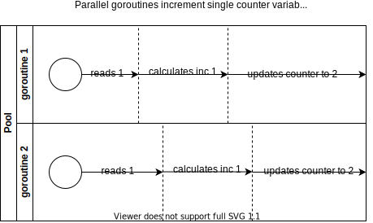
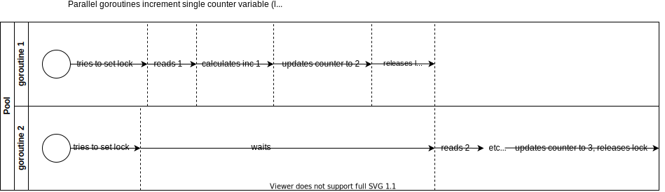

+++
title = 'Обработка данных в конкурентных программах'
date = 2020-04-02T09:00:00+03:00
draft = false
tags = ['map', 'sources']
featured_image = 'kanat.svg'
url = '/ru/post/golang-data-handling-concurrent-programs.html'

[quiz]
  [[quiz.questions]]
    question = "Что происходит, когда несколько горутин увеличивают переменную-счётчик без синхронизации?"
    type = "single-choice"
    [[quiz.questions.answers]]
      text = "Значение счётчика будет меньше ожидаемого из-за гонок данных"
      correct = true
    [[quiz.questions.answers]]
      text = "Программа вызовет панику"
      correct = false
    [[quiz.questions.answers]]
      text = "Счётчик всегда будет правильным"
      correct = false
  
  [[quiz.questions]]
    question = "Какая ошибка возникает, когда несколько горутин записывают в карту одновременно?"
    type = "single-choice"
    [[quiz.questions.answers]]
      text = "panic: concurrent map writes"
      correct = true
    [[quiz.questions.answers]]
      text = "Карта будет пустой"
      correct = false
    [[quiz.questions.answers]]
      text = "Ошибки нет, но результаты неверны"
      correct = false
  
  [[quiz.questions]]
    question = "Каковы решения для потокобезопасных операций со счётчиком?"
    type = "multiple-choice"
    [[quiz.questions.answers]]
      text = "Использование `sync.Mutex`"
      correct = true
    [[quiz.questions.answers]]
      text = "Использование каналов"
      correct = true
    [[quiz.questions.answers]]
      text = "Использование пакета atomic"
      correct = true
    [[quiz.questions.answers]]
      text = "Использование обычных переменных"
      correct = false
  
  [[quiz.questions]]
    question = "Как можно обнаружить гонки данных в программах Go?"
    type = "single-choice"
    [[quiz.questions.answers]]
      text = "Используя go test -race или go build -race"
      correct = true
    [[quiz.questions.answers]]
      text = "Используя go vet"
      correct = false
    [[quiz.questions.answers]]
      text = "Используя gofmt"
      correct = false
  
  [[quiz.questions]]
    question = "Что происходит при параллельной записи в срез без синхронизации?"
    type = "single-choice"
    [[quiz.questions.answers]]
      text = "Количество элементов будет меньше ожидаемого из-за гонок данных"
      correct = true
    [[quiz.questions.answers]]
      text = "Программа вызовет панику"
      correct = false
    [[quiz.questions.answers]]
      text = "Срез всегда будет содержать все элементы"
      correct = false
  
  [[quiz.questions]]
    question = "Почему операция инкремента (c++) не является атомарной?"
    type = "single-choice"
    [[quiz.questions.answers]]
      text = "Она состоит из трёх шагов: чтение, увеличение, запись"
      correct = true
    [[quiz.questions.answers]]
      text = "Go не поддерживает атомарные операции"
      correct = false
    [[quiz.questions.answers]]
      text = "Операция всегда атомарна"
      correct = false
  
  [[quiz.questions]]
    question = "В чём разница между sync.Mutex и sync.RWMutex?"
    type = "single-choice"
    [[quiz.questions.answers]]
      text = "RWMutex позволяет параллельные чтения, Mutex блокирует все операции"
      correct = true
    [[quiz.questions.answers]]
      text = "RWMutex быстрее Mutex"
      correct = false
    [[quiz.questions.answers]]
      text = "Нет разницы"
      correct = false
  
  [[quiz.questions]]
    question = "Почему операции с каналами являются атомарными?"
    type = "single-choice"
    [[quiz.questions.answers]]
      text = "Это встроенная функциональность Go"
      correct = true
    [[quiz.questions.answers]]
      text = "Каналы используют Mutex внутри"
      correct = false
    [[quiz.questions.answers]]
      text = "Каналы работают только в одной горутине"
      correct = false
  
  [[quiz.questions]]
    question = "Какие функции предоставляет пакет atomic для работы со счётчиками?"
    type = "multiple-choice"
    [[quiz.questions.answers]]
      text = "AddInt32"
      correct = true
    [[quiz.questions.answers]]
      text = "AddInt64"
      correct = true
    [[quiz.questions.answers]]
      text = "LoadInt32"
      correct = true
    [[quiz.questions.answers]]
      text = "SetInt32"
      correct = false
  
  [[quiz.questions]]
    question = "Как работает race detector в Go?"
    type = "single-choice"
    [[quiz.questions.answers]]
      text = "Отслеживает одновременный доступ к одной и той же памяти"
      correct = true
    [[quiz.questions.answers]]
      text = "Проверяет синтаксис кода"
      correct = false
    [[quiz.questions.answers]]
      text = "Анализирует производительность"
      correct = false
  
  [[quiz.questions]]
    question = "Что такое проблема 'замыкания цикла' в горутинах?"
    type = "single-choice"
    [[quiz.questions.answers]]
      text = "Все горутины используют одно и то же значение переменной цикла"
      correct = true
    [[quiz.questions.answers]]
      text = "Цикл выполняется слишком долго"
      correct = false
    [[quiz.questions.answers]]
      text = "Горутины не могут завершиться"
      correct = false
  
  [[quiz.questions]]
    question = "Какие типы данных можно безопасно использовать в конкурентных программах без дополнительной синхронизации?"
    type = "single-choice"
    [[quiz.questions.answers]]
      text = "Никакие - все требуют синхронизации при записи"
      correct = true
    [[quiz.questions.answers]]
      text = "Только каналы"
      correct = false
    [[quiz.questions.answers]]
      text = "Все типы Go"
      correct = false
  
  [[quiz.questions]]
    question = "Почему пустая структура struct{} используется в каналах для сигналов?"
    type = "single-choice"
    [[quiz.questions.answers]]
      text = "Это наименьший по размеру тип данных в Go"
      correct = true
    [[quiz.questions.answers]]
      text = "Она быстрее других типов"
      correct = false
    [[quiz.questions.answers]]
      text = "Она обязательна для каналов"
      correct = false
  
  [[quiz.questions]]
    question = "Что происходит при одновременном чтении и записи в map?"
    type = "single-choice"
    [[quiz.questions.answers]]
      text = "panic: concurrent map writes или гонки данных при чтении"
      correct = true
    [[quiz.questions.answers]]
      text = "Операции выполняются корректно"
      correct = false
    [[quiz.questions.answers]]
      text = "Map автоматически синхронизируется"
      correct = false
  
  [[quiz.questions]]
    question = "Как функция runtime_procPin помогает в атомарных операциях?"
    type = "single-choice"
    [[quiz.questions.answers]]
      text = "Гарантирует, что планировщик Go не запустит другие горутины до Unpin"
      correct = true
    [[quiz.questions.answers]]
      text = "Блокирует все горутины"
      correct = false
    [[quiz.questions.answers]]
      text = "Увеличивает приоритет горутины"
      correct = false
+++

В Go у нас есть функциональность горутин из коробки. Мы можем запускать код параллельно. Однако в нашем параллельно выполняющемся коде мы можем работать с общими переменными, и не совсем понятно, как именно Go обрабатывает такие ситуации.

<!--more-->

Начнём с задачи "счётчик" — попробуем увеличить переменную-счётчик 200 раз в нескольких горутинах.

```go
c := 0
wg := sync.WaitGroup{}
n := 200
wg.Add(n)
for i := 0; i < n; i++ {
	go func() {
		c++
		wg.Done()
	}()
}
wg.Wait()

fmt.Println(c)

// 194
```

Результирующее значение счётчика каждый раз отличается и в большинстве случаев не равно 200. Таким образом, этот код не является потокобезопасным и не работает как задумано, даже если у нас нет ошибок компилятора или времени выполнения.

Следующий случай — попробуем вставить 200 значений в срез параллельно и проверим, есть ли там ровно 200 значений.

```go
c := []int{}
wg := sync.WaitGroup{}
n := 200
wg.Add(n)
for i := 0; i < n; i++ {
	go func() {
		c = append(c, 1)
		wg.Done()
	}()
}
wg.Wait()

fmt.Println(len(c))

// 129
```

Количество значений в срезе ещё дальше от 200, чем было в задаче со счётчиком. Этот код также не является потокобезопасным.

Попробуем вставить 200 значений в map параллельно:

```go
c := map[int]int{}
wg := sync.WaitGroup{}
n := 200
wg.Add(n)
for i := 0; i < n; i++ {
	go func(i int) {
		c[i] = i
		wg.Done()
	}(i)
}
wg.Wait()

fmt.Println(len(c))

// panic: concurrent map writes
```

Мы не можем проверить результат из-за паники.

Во всех 3 задачах у нас есть неработающий код, но только с map есть сообщение об ошибке о конкурентных записях в map, реализованное разработчиками Go.

## Обнаружение гонок данных

В Go есть инструмент для обнаружения таких ситуаций, называемый обнаружением гонок данных.

Можно запустить любой из приведённых выше тестовых случаев с флагом race — `go test -race ./test.go`. В результате Go отображает горутины с гонкой данных:

```bash
go test -race ./test.go

==================
WARNING: DATA RACE
Read at 0x00c0000a6070 by goroutine 9:
command-line-arguments.Test.func1()
/go/src/github.com/antelman107/go_blog/test.go:16 +0x38

Previous write at 0x00c0000a6070 by goroutine 8:
command-line-arguments.Test.func1()
/go/src/github.com/antelman107/go_blog/test.go:16 +0x4e

Goroutine 9 (running) created at:
command-line-arguments.Test()
/go/src/github.com/antelman107/go_blog/test.go:15 +0xe8
testing.tRunner()
/usr/local/Cellar/go/1.14/libexec/src/testing/testing.go:992 +0x1eb
--- FAIL: Test (0.01s)
testing.go:906: race detected during execution of test
FAIL
FAIL    command-line-arguments  0.025s
FAIL
```

Обнаружение гонок данных — это не функциональность `go test`. Можно даже собрать программу в режиме обнаружения гонок:

```bash
$ go test -race mypkg    // для тестирования пакета
$ go run -race .  // для запуска исходного файла
$ go build -race .   // для сборки команды
$ go install -race mypkg // для установки пакета
```

Хорошо, что можно напрямую обнаруживать гонки данных в программе.

Даже популярная проблема "замыкания цикла" может быть обнаружена:

```go
wg := sync.WaitGroup{}
n := 10
wg.Add(n)
for i := 0; i < n; i++ {
	go func() {
		fmt.Println(i)
		wg.Done()
	}()
}
wg.Wait()
```

Проблема здесь в том, что код не выведет точные числа 0, 1, 2 ... 9, а случайные числа от 0 до 9.

## Решение

Опишем решение для задачи со счётчиком. Это решение можно использовать для задач со срезом и map.

Итак, у нас есть значение счётчика, которое меньше ожидаемого.
Несмотря на краткость вызова инкремента (`c++`), программа фактически выполняет следующий список действий:

1. чтение текущего значения счётчика из памяти,
2. его увеличение,
3. сохранение результата в память.

Проблема возникает потому, что некоторые горутины читают одно и то же начальное значение счётчика. После чтения того же начального значения такие горутины изменяют его одинаковым образом. Это поведение объясняется на диаграмме:



Чем больше у нас таких ситуаций чтения одного и того же начального значения, тем больше результат счётчика отличается от 200.

Решением здесь может быть атомарное изменение переменной. Если какая-то горутина читает начальное значение счётчика, следующим действием должно быть единственное обновление счётчика от этой горутины. Ни одна из других горутин не должна обращаться к счётчику или изменять его в середине этой операции.

Если мы добавим логику синхронизации, как описано выше, диаграмма будет выглядеть следующим образом:


### Решение `sync.Mutex`/`sync.RWMutex`

Мы можем использовать методы `Lock` и `Unlock` для гарантии того, что только одна горутина работает со счётчиком в каждый момент времени.

Мы также можем использовать `sync.RWMutex` для обеспечения параллельных чтений.

Но в нашей задаче Mutex полностью достаточен:

```go
c := 0
n := 200
m := sync.Mutex{}
wg := sync.WaitGroup{}
wg.Add(n)
for i := 0; i < n; i++ {
	go func(i int) {
		m.Lock()
		c++
		m.Unlock()
		wg.Done()
	}(i)
}
wg.Wait()

fmt.Println(c)

// 200 == OK
```

### Решение через каналы

Операции с каналами являются атомарными из коробки.

Мы можем отправлять любые данные в канал с одним читателем для обеспечения последовательной обработки.

Но для этого нам нужен дополнительный код:

```go
c := 0
n := 200

ch := make(chan struct{}, n)
chanWg := sync.WaitGroup{}
chanWg.Add(1)
go func() {
	for range ch {
		c++
	}
	chanWg.Done()
}()

wg := sync.WaitGroup{}
wg.Add(n)
for i := 0; i < n; i++ {
	go func(i int) {
		ch <- struct{}{}
		wg.Done()
	}(i)
}
wg.Wait()
close(ch)
chanWg.Wait()

fmt.Println(c)

// 200 = OK
```

Мы также использовали здесь пустую структуру, потому что это наименьший по размеру тип данных переменной в Go.

### Решение через пакет atomic

Стандартный пакет Go под названием `atomic` предоставляет набор атомарных операций.

Благодаря функциям `runtime_procPin` / `runtime_procUnpin` (в исходниках Go).

Функция `Pin` гарантирует, что планировщик Go не запустит никакую другую горутину до тех пор, пока не будет вызван `Unpin`.

У нас есть несколько функций счётчика в пакете atomic, которые помогают реализовать наш атомарный счётчик:

```go
c := int32(0)
n := 200

wg := sync.WaitGroup{}
wg.Add(n)
for i := 0; i < n; i++ {
	go func(i int) {
		atomic.AddInt32(&c, 1)
		wg.Done()
	}(i)
}
wg.Wait()

fmt.Println(c)

// 200 = OK
```

Проблему атомарного изменения данных можно встретить во многих ситуациях разработки.
Например, та же проблема возникает с запросами SELECT + UPDATE в SQL базах данных при работе нескольких процессов.
