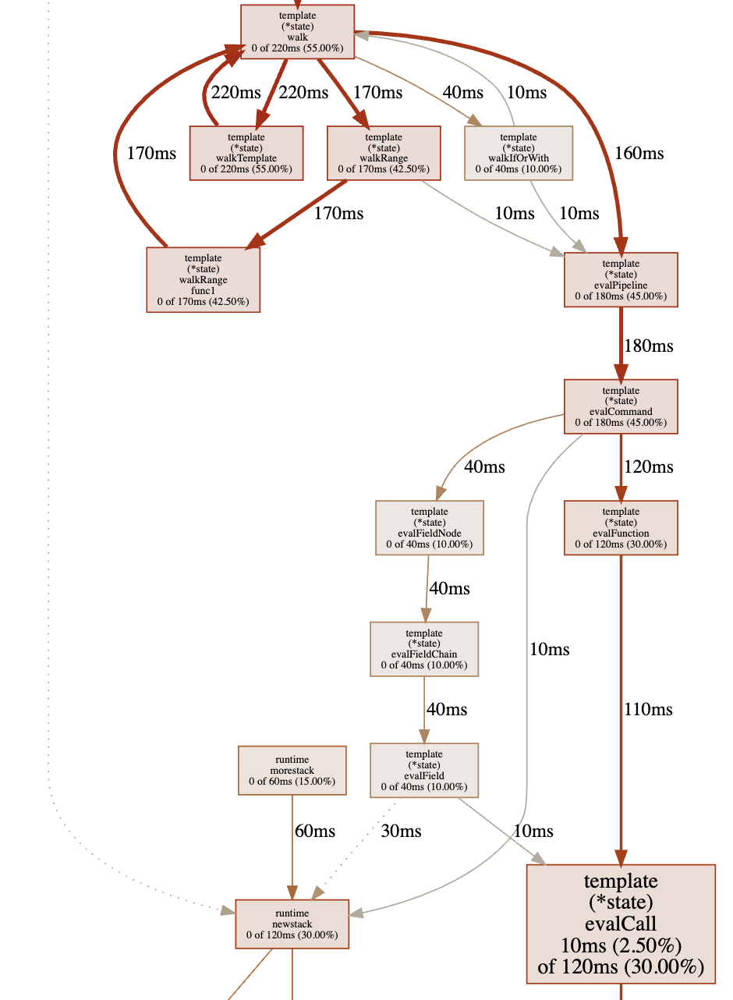

+++
title = 'Профилирование Go: основы и практика'
date = 2020-04-23T09:00:00+03:00
draft = false
tags = ['profiling', 'pprof', 'benchmark', 'ab', 'cpu', 'allocation', 'remote']
featured_image = 'goph.svg'
url = '/ru/post/profiling.html'

[quiz]
  [[quiz.questions]]
    question = "Каковы основные причины использования профилирования?"
    type = "multiple-choice"
    [[quiz.questions.answers]]
      text = "Найти долгое время выполнения"
      correct = true
    [[quiz.questions.answers]]
      text = "Найти логические ошибки"
      correct = false
    [[quiz.questions.answers]]
      text = "Найти высокое потребление памяти"
      correct = true
    [[quiz.questions.answers]]
      text = "Найти высокую нагрузку на процессор"
      correct = true
  
  [[quiz.questions]]
    question = "Какой самый простой способ включить профилирование в программе Go?"
    type = "single-choice"
    [[quiz.questions.answers]]
      text = "Импортировать `net/http/pprof` и запустить HTTP-сервер"
      correct = true
    [[quiz.questions.answers]]
      text = "Использовать go tool pprof напрямую"
      correct = false
    [[quiz.questions.answers]]
      text = "Добавить код профилирования вручную"
      correct = false
  
  [[quiz.questions]]
    question = "Какая команда используется для анализа данных профилирования?"
    type = "single-choice"
    [[quiz.questions.answers]]
      text = "go tool pprof"
      correct = true
    [[quiz.questions.answers]]
      text = "go prof"
      correct = false
    [[quiz.questions.answers]]
      text = "pprof analyze"
      correct = false
  
  [[quiz.questions]]
    question = "Какие типы профилирования наиболее полезны?"
    type = "multiple-choice"
    [[quiz.questions.answers]]
      text = "Профилирование CPU"
      correct = true
    [[quiz.questions.answers]]
      text = "Профилирование памяти"
      correct = true
    [[quiz.questions.answers]]
      text = "Профилирование сети"
      correct = false
  
  [[quiz.questions]]
    question = "Какой endpoint используется для получения профиля CPU?"
    type = "single-choice"
    [[quiz.questions.answers]]
      text = "/debug/pprof/profile"
      correct = true
    [[quiz.questions.answers]]
      text = "/debug/pprof/cpu"
      correct = false
    [[quiz.questions.answers]]
      text = "/debug/pprof/performance"
      correct = false
  
  [[quiz.questions]]
    question = "Какие типы профилей доступны через net/http/pprof?"
    type = "multiple-choice"
    [[quiz.questions.answers]]
      text = "heap (память)"
      correct = true
    [[quiz.questions.answers]]
      text = "goroutine"
      correct = true
    [[quiz.questions.answers]]
      text = "mutex"
      correct = true
    [[quiz.questions.answers]]
      text = "network"
      correct = false
  
  [[quiz.questions]]
    question = "Какая команда в pprof используется для вывода топ функций по времени выполнения?"
    type = "single-choice"
    [[quiz.questions.answers]]
      text = "top"
      correct = true
    [[quiz.questions.answers]]
      text = "list"
      correct = false
    [[quiz.questions.answers]]
      text = "show"
      correct = false
  
  [[quiz.questions]]
    question = "Какая команда в pprof используется для просмотра исходного кода функции с указанием времени выполнения?"
    type = "single-choice"
    [[quiz.questions.answers]]
      text = "list"
      correct = true
    [[quiz.questions.answers]]
      text = "source"
      correct = false
    [[quiz.questions.answers]]
      text = "code"
      correct = false
  
  [[quiz.questions]]
    question = "Что делает команда 'web' в pprof?"
    type = "single-choice"
    [[quiz.questions.answers]]
      text = "Выводит схему функций в виде изображения"
      correct = true
    [[quiz.questions.answers]]
      text = "Открывает веб-браузер"
      correct = false
    [[quiz.questions.answers]]
      text = "Запускает веб-сервер"
      correct = false
  
  [[quiz.questions]]
    question = "Какой инструмент используется для нагрузки на сервис в примере профилирования?"
    type = "single-choice"
    [[quiz.questions.answers]]
      text = "Apache Benchmark (ab)"
      correct = true
    [[quiz.questions.answers]]
      text = "curl"
      correct = false
    [[quiz.questions.answers]]
      text = "wget"
      correct = false
  
  [[quiz.questions]]
    question = "Почему важно быть осторожным при удалённом профилировании?"
    type = "multiple-choice"
    [[quiz.questions.answers]]
      text = "Вызовы профилировщика замедляют сервис"
      correct = true
    [[quiz.questions.answers]]
      text = "Endpoint профилирования может быть уязвимостью"
      correct = true
    [[quiz.questions.answers]]
      text = "Профилирование требует много памяти"
      correct = false
  
  [[quiz.questions]]
    question = "Что такое flamegraph?"
    type = "single-choice"
    [[quiz.questions.answers]]
      text = "Инструмент визуализации данных профилирования"
      correct = true
    [[quiz.questions.answers]]
      text = "Тип профиля в pprof"
      correct = false
    [[quiz.questions.answers]]
      text = "Команда go tool pprof"
      correct = false
  
  [[quiz.questions]]
    question = "Какой пакет используется для автоматического предоставления endpoint'ов профилирования?"
    type = "single-choice"
    [[quiz.questions.answers]]
      text = "net/http/pprof"
      correct = true
    [[quiz.questions.answers]]
      text = "runtime/pprof"
      correct = false
    [[quiz.questions.answers]]
      text = "go/pprof"
      correct = false
  
  [[quiz.questions]]
    question = "Что происходит при импорте net/http/pprof?"
    type = "single-choice"
    [[quiz.questions.answers]]
      text = "Автоматически регистрируются HTTP handlers для профилирования"
      correct = true
    [[quiz.questions.answers]]
      text = "Начинается автоматическое профилирование"
      correct = false
    [[quiz.questions.answers]]
      text = "Создаётся файл профиля"
      correct = false
  
  [[quiz.questions]]
    question = "Какой параметр используется в запросе профиля CPU для указания длительности сбора данных?"
    type = "single-choice"
    [[quiz.questions.answers]]
      text = "seconds"
      correct = true
    [[quiz.questions.answers]]
      text = "duration"
      correct = false
    [[quiz.questions.answers]]
      text = "time"
      correct = false
+++

Go имеет богатые инструменты профилирования с самого начала — пакет `pprof` и `go tool pprof`. Давайте обсудим, почему профилирование полезно, как с ним работать и что нового в этой области.

<!--more-->

## Почему профилирование полезно

При использовании отладчика можно найти логические ошибки. Это базовая отладка.

Программа может работать логически правильно, но могут появиться следующие побочные эффекты:

- долгое выполнение в некоторых случаях;
- высокое потребление памяти;
- высокая нагрузка на процессор;

Всё вышеперечисленное не является ошибкой, пока программа продолжает функционировать. Однако высокое потребление ресурсов дорого обходится владельцам сервисов — для поддержки таких сервисов время от времени требуются новые аппаратные ресурсы.

Если внешняя нагрузка на сервис увеличивается, все эти "слабые места" могут стать причиной неожиданных сбоев — если у сервиса закончится память, он просто завершит работу; если не хватает CPU, сервер станет недоступен даже для SSH-подключений.

Профилировщик чрезвычайно полезен для проверки программы с целью найти такие проблемы.

## Какой инструмент подходит для профилирования

Стандартный инструмент профилировщика Go — `pprof` — отличный. Давайте использовать `pprof`.

## Как профилировать

Профилирование состоит из двух действий:

1. сбор данных профилирования из сервиса;
2. визуализация и анализ данных;

Для сбора данных профилирования следует:

- реализовать ручной сбор метрик и экспорт с помощью пакета `pprof`, или
- запустить endpoint `net/http/pprof`, который предоставляет экспорт данных профилирования;

Для начинающих проще использовать вариант 2.

Чтобы запустить endpoint профилирования, следует:

- добавить `import _ "net/http/pprof"` в код программы;
- если в программе уже запущен сервер `net/http` — больше ничего не требуется;
- если нет, следует добавить код запуска сервера:

```go
go func() {
    log.Println(http.ListenAndServe("localhost:6060", nil))
}()
```

Согласно исходному коду `net/http/pprof`, становится очевидным, что делает этот импорт:

```go
func init() {
    http.HandleFunc("/debug/pprof/", Index)
    http.HandleFunc("/debug/pprof/cmdline", Cmdline)
    http.HandleFunc("/debug/pprof/profile", Profile)
    http.HandleFunc("/debug/pprof/symbol", Symbol)
    http.HandleFunc("/debug/pprof/trace", Trace)
}
```

## Пример профилирования

Я собираюсь профилировать веб-сервис, запущенный на `localhost:8090`.

Я импортировал `net/http/pprof` и добавил запуск HTTP-сервера.

### Получение данных профиля

Сначала я собираюсь нагрузить мой сервис с помощью инструмента Apache Benchmark (`ab`):

```bash
ab -n 1000 -c10 http://localhost:8090/
```

`ab` выводит свою собственную статистику о времени запросов, но сейчас она мне не нужна. Я собираюсь анализировать данные профилирования.

Пока сервис под нагрузкой, я запрашиваю данные профилирования CPU на следующие 5 секунд:

```bash
curl http://localhost:6060/debug/pprof/profile?seconds=5 > ./profile
```

В результате файл профиля загружается. Это всё для получения данных профилирования. Давайте проанализируем их.

### Анализ профиля CPU

Давайте откроем данные профилирования, которые я только что загрузил, с помощью `go tool pprof`:

```bash
go tool pprof ./profile
```

```
Type: cpu
Time: Apr 19, 2020 at 9:28pm (+03)
Duration: 5.40s, Total samples = 400ms ( 7.41%)
Entering interactive mode (type "help" for commands, "o" for options)
```

Мы можем вывести данные в виде изображения:

```
(pprof) web
```

Это требует установки инструмента Graphviz.

В результате я получил схему функций, где самые долго работающие функции больше других.



Как мы видим, больше всего времени тратится на вызовы пакета `html/template`, что вовлекает нас в исходники Go. Это стандартное поведение профилировщика — неважно, из кода приложения функция или из исходников Go.

Давайте вернёмся к терминалу pprof и выведем топ-15 функций по времени работы:

```
(pprof) top15
```

```
Showing nodes accounting for 0, 0% of 400ms total
Showing top 15 nodes out of 147
      flat  flat%   sum%        cum   cum%
         0     0%     0%      260ms 65.00%  net/http.(*conn).serve
         0     0%     0%      240ms 60.00%  github.com/labstack/echo.(*Echo).ServeHTTP
         0     0%     0%      240ms 60.00%  github.com/labstack/echo.(*Echo).ServeHTTP.func1
         0     0%     0%      240ms 60.00%  github.com/labstack/echo.(*Echo).add.func1
         0     0%     0%      240ms 60.00%  github.com/labstack/echo.(*context).Render
         0     0%     0%      240ms 60.00%  github.com/labstack/echo/middleware.AddTrailingSlashWithConfig.func1.1
         0     0%     0%      240ms 60.00%  github.com/labstack/echo/middleware.CORSWithConfig.func1.1
         0     0%     0%      240ms 60.00%  net/http.serverHandler.ServeHTTP
         0     0%     0%      220ms 55.00%  html/template.(*Template).Execute
         0     0%     0%      220ms 55.00%  text/template.(*Template).Execute
         0     0%     0%      220ms 55.00%  text/template.(*Template).execute
         0     0%     0%      220ms 55.00%  text/template.(*state).walk
         0     0%     0%      220ms 55.00%  text/template.(*state).walkTemplate
```

Рендеринг шаблонов также в топе.

Мы можем вывести исходный код любой функции, чтобы увидеть, какая часть занимает какое время:

```
(pprof) list text/template.\(\*state\).walk$
```

```
Total: 400ms
ROUTINE ======================== text/template.(*state).walk in /usr/local/Cellar/go/1.14/libexec/src/text/template/exec.go
         0      830ms (flat, cum) 207.50% of Total
         .          .    250:	s.at(node)
         .          .    251:	switch node := node.(type) {
         .          .    252:	case *parse.ActionNode:
         .          .    253:		// Do not pop variables so they persist until next end.
         .          .    254:		// Also, if the action declares variables, don't print the result.
    160ms    160ms    255:		val := s.evalPipeline(dot, node.Pipe)
         .          .    256:		if len(node.Pipe.Decl) == 0 {
     20ms     20ms    257:			s.printValue(node, val)
         .          .    258:		}
         .          .    259:	case *parse.IfNode:
     40ms     40ms    260:		s.walkIfOrWith(parse.NodeIf, dot, node.Pipe, node.List, node.ElseList)
         .          .    261:	case *parse.ListNode:
         .          .    262:		for _, node := range node.Nodes {
    220ms    220ms    263:			s.walk(dot, node)
         .          .    264:		}
         .          .    265:	case *parse.RangeNode:
    170ms    170ms    266:		s.walkRange(dot, node)
         .          .    267:	case *parse.TemplateNode:
    220ms    220ms    268:		s.walkTemplate(dot, node)
         .          .    269:	case *parse.TextNode:
         .          .    270:		if _, err := s.wr.Write(node.Text); err != nil {
         .          .    271:			s.writeError(err)
         .          .    272:		}
         .          .    273:	case *parse.WithNode:
```

Выводы:

- здесь есть рекурсия (строка 263);
- есть вызовы пакета `reflect`, которые считаются "тяжёлыми";
- я не могу изменить исходный код Go.

Но я могу изменить код моего сервиса, который вызывает стандартные пакеты Go. В настоящее время в моём сервисе есть вызов шаблона при каждом запросе клиента. Однако шаблоны статичны и постоянны. Результат вызова шаблона зависит от данных запроса.

Я собираюсь кэшировать результат вызова шаблона — рендеринг будет вызываться один раз для каждой комбинации данных запроса. При первом запросе в кэше нет данных. В этом случае выполняется вызов шаблона. Результат вызова шаблона сохраняется в кэш с ключом, сгенерированным из данных запроса. При каждом запросе сервис проверяет, есть ли данные в кэше по определённому ключу. И сервис использует кэшированные данные, если они есть.

Я изменил код сервиса и снова запустил профилирование. Результаты ниже:

```
(pprof) top15
```

```
Showing nodes accounting for 90ms, 50.00% of 180ms total
Showing top 15 nodes out of 78
      flat  flat%   sum%        cum   cum%
         0     0%     0%      100ms 55.56%  net/http.(*conn).serve
     90ms 50.00% 50.00%       90ms 50.00%  syscall.syscall
         0     0% 50.00%       60ms 33.33%  bufio.(*Writer).Flush
         0     0% 50.00%       60ms 33.33%  internal/poll.(*FD).Write
         0     0% 50.00%       60ms 33.33%  net.(*conn).Write
         0     0% 50.00%       60ms 33.33%  net.(*netFD).Write
         0     0% 50.00%       60ms 33.33%  net/http.(*response).finishRequest
         0     0% 50.00%       60ms 33.33%  net/http.checkConnErrorWriter.Write
         0     0% 50.00%       60ms 33.33%  syscall.Write
         0     0% 50.00%       60ms 33.33%  syscall.write
         0     0% 50.00%       40ms 22.22%  runtime.findrunnable
         0     0% 50.00%       40ms 22.22%  runtime.mcall
         0     0% 50.00%       40ms 22.22%  runtime.schedule
         0     0% 50.00%       30ms 16.67%  github.com/labstack/echo.(*Echo).Start
```

Как мы видим, теперь в топе есть вызовы `syscall.Write`. И вызовы шаблонов больше не в топе.

Это отлично! Потому что цель наших изменений — сделать поведение приложения как можно быстрее, чтобы базовые операции ОС — чтение и отправка данных по сети — оказались наверху.

Теперь давайте сравним результаты `ab` — строку "Requests per second":

- **До:** Requests per second: 14.13 [#/sec] (mean)
- **После:** Requests per second: 638.38 [#/sec] (mean)

Как мы видим, сервис теперь работает намного быстрее.

## Заключение

Можно открыть endpoint `net/http/pprof` в браузере. Это тот же endpoint, который мы использовали через `curl` для получения данных профилирования. Страница выглядит следующим образом:

`/debug/pprof/`

Доступные типы профилей:

| Count | Profile |
|-------|---------|
| 9     | allocs  |
| 0     | block   |
| 0     | cmdline |
| 9     | goroutine |
| 9     | heap    |
| 0     | mutex   |
| 0     | profile |
| 18    | threadcreate |
| 0     | trace   |

Мы можем получить другие метрики:

- о выделении памяти в каждой функции;
- о вызовах `sync.Mutex`;
- о создании новых потоков;
- и многие другие.

Наиболее полезными здесь являются профилирование CPU и памяти.

## Удалённое профилирование

Endpoint профилирования `pprof`, который мы включили выше, может быть доступен из внешней сети:

```go
// сервер слушает на всех сетевых интерфейсах (не только localhost), порт 6060
log.Println(http.ListenAndServe(":6060", nil))
```

Но следует быть осторожным и ограничить доступ только для разработчиков!

Очень полезно профилировать продакшн-сервисы, но endpoint профилирования, доступный для внешних клиентских запросов, является уязвимостью — вызовы профилировщика замедляют сервис.

## Что нового в теме профилирования

Подход предоставления данных профилирования покрывает любую ситуацию и не будет изменяться.

Однако анализ данных здесь можно улучшить. Было выпущено много инструментов визуализации.

Для меня наиболее полезным является flamegraph.

В IDE GoLand есть возможности отображения данных профилирования Go. Но `go tool pprof` также предоставляет богатую функциональность фильтрации и сортировки. В этой статье такая функциональность не рассматривается, но есть примеры в блоге Go.


