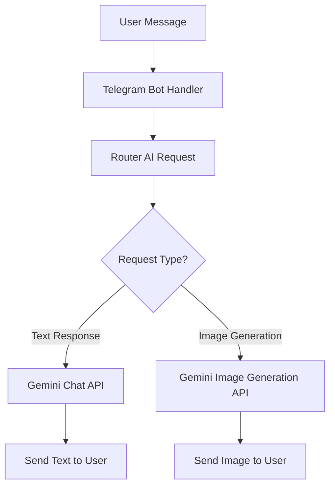

+++
title = 'Building an AI Telegram Bot with Go, Gemini API, and AWS Lambda'
date = 2024-12-19T09:00:00+03:00
draft = false
tags = ['go', 'telegram', 'gemini', 'ai', 'aws', 'lambda', 'bot']
url = '/en/post/go-telegram-gemini-ai-bot.html'

[quiz]
  [[quiz.questions]]
    question = "What is the primary role of the router AI in this bot architecture?"
    type = "single-choice"
    [[quiz.questions.answers]]
      text = "To determine the type of user request and route it to the appropriate handler"
      correct = true
    [[quiz.questions.answers]]
      text = "To generate images directly"
      correct = false
    [[quiz.questions.answers]]
      text = "To handle Telegram webhook requests"
      correct = false
  
  [[quiz.questions]]
    question = "What API is used for image generation in this bot?"
    type = "single-choice"
    [[quiz.questions.answers]]
      text = "Gemini Image Generation API (gemini-2.5-flash-image)"
      correct = true
    [[quiz.questions.answers]]
      text = "OpenAI DALL-E API"
      correct = false
    [[quiz.questions.answers]]
      text = "Stable Diffusion API"
      correct = false
  
  [[quiz.questions]]
    question = "What is the main benefit of deploying the bot as an AWS Lambda function?"
    type = "multiple-choice"
    [[quiz.questions.answers]]
      text = "Serverless architecture"
      correct = true
    [[quiz.questions.answers]]
      text = "Automatic scaling"
      correct = true
    [[quiz.questions.answers]]
      text = "Cost efficiency"
      correct = true
    [[quiz.questions.answers]]
      text = "Requires manual server management"
      correct = false
  
  [[quiz.questions]]
    question = "What pattern allows easy extension to new request types like voice or video generation?"
    type = "single-choice"
    [[quiz.questions.answers]]
      text = "Router pattern"
      correct = true
    [[quiz.questions.answers]]
      text = "Singleton pattern"
      correct = false
    [[quiz.questions.answers]]
      text = "Factory pattern"
      correct = false
  
  [[quiz.questions]]
    question = "Why is AWS S3 used for storing conversation history in a Lambda bot?"
    type = "single-choice"
    [[quiz.questions.answers]]
      text = "Lambda functions are stateless, so external storage is required"
      correct = true
    [[quiz.questions.answers]]
      text = "S3 is faster than a database"
      correct = false
    [[quiz.questions.answers]]
      text = "S3 provides built-in indexing"
      correct = false
  
  [[quiz.questions]]
    question = "How are conversations stored in S3?"
    type = "single-choice"
    [[quiz.questions.answers]]
      text = "Each conversation as a JSON file, key is chat ID"
      correct = true
    [[quiz.questions.answers]]
      text = "All conversations in a single file"
      correct = false
    [[quiz.questions.answers]]
      text = "As binary data"
      correct = false
  
  [[quiz.questions]]
    question = "What is the cold start time for Go-based Lambda functions?"
    type = "single-choice"
    [[quiz.questions.answers]]
      text = "Typically under 100ms"
      correct = true
    [[quiz.questions.answers]]
      text = "Around 1 second"
      correct = false
    [[quiz.questions.answers]]
      text = "More than 5 seconds"
      correct = false
  
  [[quiz.questions]]
    question = "What payment model does AWS Lambda use?"
    type = "single-choice"
    [[quiz.questions.answers]]
      text = "Pay for actual execution time"
      correct = true
    [[quiz.questions.answers]]
      text = "Fixed monthly fee"
      correct = false
    [[quiz.questions.answers]]
      text = "Pay for allocated resources"
      correct = false
  
  [[quiz.questions]]
    question = "What does AWS Lambda free tier include?"
    type = "multiple-choice"
    [[quiz.questions.answers]]
      text = "1 million requests per month"
      correct = true
    [[quiz.questions.answers]]
      text = "400,000 GB-seconds of compute time per month"
      correct = true
    [[quiz.questions.answers]]
      text = "Unlimited requests"
      correct = false
  
  [[quiz.questions]]
    question = "How does Telegram bot integration with Lambda work?"
    type = "single-choice"
    [[quiz.questions.answers]]
      text = "Via webhook that sends events to Lambda through API Gateway"
      correct = true
    [[quiz.questions.answers]]
      text = "Through persistent connection"
      correct = false
    [[quiz.questions.answers]]
      text = "Through polling every second"
      correct = false
  
  [[quiz.questions]]
    question = "Why is message history needed for an AI bot?"
    type = "multiple-choice"
    [[quiz.questions.answers]]
      text = "To understand conversation context"
      correct = true
    [[quiz.questions.answers]]
      text = "To maintain dialogue coherence"
      correct = true
    [[quiz.questions.answers]]
      text = "To remember previously discussed topics"
      correct = true
    [[quiz.questions.answers]]
      text = "To increase response speed"
      correct = false
  
  [[quiz.questions]]
    question = "Where do API keys for the bot come from (Telegram token and Gemini API key)?"
    type = "single-choice"
    [[quiz.questions.answers]]
      text = "From Lambda function environment variables"
      correct = true
    [[quiz.questions.answers]]
      text = "Hardcoded in the code"
      correct = false
    [[quiz.questions.answers]]
      text = "From a configuration file in S3"
      correct = false
  
  [[quiz.questions]]
    question = "What request type does the router return for regular text conversation?"
    type = "single-choice"
    [[quiz.questions.answers]]
      text = "RequestTypeText with message field"
      correct = true
    [[quiz.questions.answers]]
      text = "RequestTypeImage with prompt field"
      correct = false
    [[quiz.questions.answers]]
      text = "RequestTypeVoice"
      correct = false
  
  [[quiz.questions]]
    question = "Why are Lambda functions ideal for Telegram bots?"
    type = "multiple-choice"
    [[quiz.questions.answers]]
      text = "Event-driven architecture matches webhook model"
      correct = true
    [[quiz.questions.answers]]
      text = "Stateless design aligns with webhook-based bot architecture"
      correct = true
    [[quiz.questions.answers]]
      text = "Automatic scaling to handle traffic spikes"
      correct = true
    [[quiz.questions.answers]]
      text = "Require constant internet connection"
      correct = false
  
  [[quiz.questions]]
    question = "What happens when processing a message with conversation history?"
    type = "single-choice"
    [[quiz.questions.answers]]
      text = "History is loaded from S3, new message is added, full context is sent to Gemini, updated conversation is saved back to S3"
      correct = true
    [[quiz.questions.answers]]
      text = "History is loaded once when Lambda starts"
      correct = false
    [[quiz.questions.answers]]
      text = "History is stored in Lambda function memory"
      correct = false
+++

In this article, we'll explore how to build an intelligent Telegram bot using Go that acts as a proxy between users and Google's Gemini API. The bot will handle two primary functions: answering user messages and generating images. While this mechanism can be significantly extended with additional capabilities like voice and video generation, we'll focus on these two request types for simplicity.

<!--more-->

## Architecture Overview

The bot uses an intelligent routing mechanism where the first request to the AI acts as a router to determine the type of user request. The AI is instructed to either return a normal conversational response or a structured output that can be forwarded to a specialized model for image generation.



## Project Structure

Let's start by setting up the basic project structure:

```go
package main

import (
    "bytes"
    "context"
    "encoding/json"
    "fmt"
    "os"
    
    "github.com/aws/aws-sdk-go-v2/aws"
    "github.com/aws/aws-sdk-go-v2/service/s3"
    tgbotapi "github.com/go-telegram-bot-api/telegram-bot-api/v5"
    "google.golang.org/api/option"
    "google.golang.org/api/generativeai"
)
```

## Configuration

First, we need to configure the bot with API keys:

```go
type Config struct {
    TelegramToken string
    GeminiAPIKey  string
}

func loadConfig() *Config {
    return &Config{
        TelegramToken: os.Getenv("TELEGRAM_TOKEN"),
        GeminiAPIKey:  os.Getenv("GEMINI_API_KEY"),
    }
}
```

## Router Implementation

The router uses Gemini to analyze the user's message and determine the appropriate action:

```go
type RequestType string

const (
    RequestTypeText  RequestType = "text"
    RequestTypeImage RequestType = "image"
)

type RouterResponse struct {
    Type    RequestType `json:"type"`
    Prompt  string      `json:"prompt,omitempty"`
    Message string      `json:"message,omitempty"`
}
```

The router prompt should be concise and clear:

```
You are a request router for a Telegram bot. Analyze user messages and respond with JSON:
- If the user wants an image generated, return: {"type":"image","prompt":"description"}
- Otherwise, return: {"type":"text","message":"your response"}
```

Here's the router implementation:

```go
func routeRequest(ctx context.Context, client *generativeai.Client, 
                  userMsg string) RouterResponse {
    model := client.GenerativeModel("gemini-3-pro-preview")
    model.SystemInstruction = "Route requests: return JSON with type and prompt/message"
    
    resp, _ := model.GenerateContent(ctx, userMsg)
    var routerResp RouterResponse
    json.Unmarshal([]byte(resp.Text), &routerResp)
    return routerResp
}
```

## Handling Messages

Here's how we handle incoming Telegram messages:

```go
func handleMessage(ctx context.Context, bot *tgbotapi.BotAPI, 
                   client *generativeai.Client, update tgbotapi.Update) {
    userMsg := update.Message.Text
    
    routerResp := routeRequest(ctx, client, userMsg)
    
    switch routerResp.Type {
    case RequestTypeImage:
        generateAndSendImage(ctx, bot, client, update, routerResp.Prompt)
    case RequestTypeText:
        sendTextResponse(bot, update, routerResp.Message)
    }
}
```

## Text Response Handler

For regular text responses, we use Gemini's chat API:

```go
func sendTextResponse(bot *tgbotapi.BotAPI, 
                      update tgbotapi.Update, message string) {
    msg := tgbotapi.NewMessage(update.Message.Chat.ID, message)
    msg.ReplyToMessageID = update.Message.MessageID
    bot.Send(msg)
}
```

## Image Generation Handler

For image generation, we call Gemini's image generation endpoint:

```go
func generateAndSendImage(ctx context.Context, bot *tgbotapi.BotAPI,
                          client *generativeai.Client, 
                          update tgbotapi.Update, prompt string) {
    model := client.GenerativeModel("gemini-2.5-flash-image")
    resp, err := model.GenerateContent(ctx, prompt)
    if err != nil {
        sendTextResponse(bot, update, "Error generating image")
        return
    }
    photo := tgbotapi.NewPhoto(update.Message.Chat.ID, 
                               tgbotapi.FileBytes{
                                   Name: "image.png",
                                   Bytes: resp.ImageData,
                               })
    bot.Send(photo)
}
```

## Main Bot Loop

The main function sets up the bot and starts listening:

```go
func main() {
    cfg := loadConfig()
    bot, _ := tgbotapi.NewBotAPI(cfg.TelegramToken)
    client, _ := generativeai.NewClient(context.Background(),
        option.WithAPIKey(cfg.GeminiAPIKey))
    
    u := tgbotapi.NewUpdate(0)
    updates := bot.GetUpdatesChan(u)
    for update := range updates {
        if update.Message != nil {
            go handleMessage(context.Background(), bot, client, update)
        }
    }
}
```

## System Prompt Examples

Here are concise system prompts for different scenarios:

**Router Prompt:**
```
Route user requests: return JSON with "type":"image" and "prompt" for image requests, 
or "type":"text" with "message" for conversations.
```

**Chat Assistant Prompt:**
```
You are a helpful assistant. Provide clear, concise answers to user questions.
```

**Image Generation Prompt Template:**
```
Generate a high-quality image based on: {user_prompt}
```

## Extensibility

This architecture can be easily extended to support additional capabilities:

- **Voice Generation**: Add a `RequestTypeVoice` and use text-to-speech APIs
- **Video Generation**: Add a `RequestTypeVideo` and integrate video generation services
- **Multi-modal Input**: Process images, voice messages, and documents from users

The router pattern allows you to add new request types without modifying the core message handling logic.

## Message History and Context Management

For a bot to understand context and maintain coherent conversations, it needs access to message history. Since Lambda functions are stateless, we need external storage for conversation history. AWS S3 is an excellent choice for this purpose, as it integrates seamlessly with Lambda and provides durable, scalable storage.

### Why Message History Matters

AI models like Gemini perform significantly better when they have access to conversation context. Without history, each message is treated independently, making it impossible for the bot to:
- Remember previous topics discussed
- Reference earlier parts of the conversation
- Maintain personality and consistency
- Provide contextual responses based on user preferences

### Storing Conversations in S3

We can store each conversation as a JSON file in S3, using the chat ID as the key. This approach allows us to:
- **Isolate conversations**: Each user's chat history is stored separately
- **Easy retrieval**: Load the entire conversation history with a single S3 GET request
- **Cost-effective**: S3 storage is extremely cheap for text data
- **Scalable**: S3 handles millions of conversations without performance degradation

Here's how to implement conversation storage:

```go
func saveConversation(ctx context.Context, s3Client *s3.Client, 
                     chatID int64, messages []Message) error {
    key := fmt.Sprintf("conversations/%d.json", chatID)
    data, _ := json.Marshal(messages)
    
    _, err := s3Client.PutObject(ctx, &s3.PutObjectInput{
        Bucket: aws.String("bot-conversations"),
        Key:    aws.String(key),
        Body:   bytes.NewReader(data),
    })
    return err
}
```

Loading conversation history:

```go
func loadConversation(ctx context.Context, s3Client *s3.Client, 
                     chatID int64) ([]Message, error) {
    key := fmt.Sprintf("conversations/%d.json", chatID)
    resp, err := s3Client.GetObject(ctx, &s3.GetObjectInput{
        Bucket: aws.String("bot-conversations"),
        Key:    aws.String(key),
    })
    if err != nil {
        return []Message{}, nil // Return empty if not found
    }
    defer resp.Body.Close()
    
    var messages []Message
    json.NewDecoder(resp.Body).Decode(&messages)
    return messages, nil
}
```

When processing a message, load the history, append the new message, send the full context to Gemini, and save the updated conversation back to S3. This ensures the bot maintains context across multiple interactions while leveraging Lambda's stateless architecture.

## AWS Lambda Deployment

Deploying this bot as an AWS Lambda function provides several significant advantages over traditional server-based deployments. Let's explore why Lambda is particularly well-suited for Telegram bots:

### Why Lambda is Beneficial for Telegram Bots

**1. Cost Efficiency**
- **Pay-per-use model**: You only pay for the actual execution time of your bot. If your bot receives 1000 messages per day, you pay for processing those 1000 messages, not for 24/7 server uptime.
- **No idle costs**: Unlike a traditional server that runs continuously (costing money even when idle), Lambda functions only consume resources when processing requests.
- **Free tier**: AWS Lambda offers a generous free tier (1 million requests and 400,000 GB-seconds of compute time per month), which is often sufficient for small to medium bots.

**2. Automatic Scaling**
- **Handles traffic spikes**: If your bot suddenly receives hundreds of messages simultaneously (viral moment, marketing campaign), Lambda automatically scales to handle the load without manual intervention.
- **No capacity planning**: You don't need to estimate server capacity or worry about provisioning resources. Lambda handles this automatically.
- **Concurrent executions**: Lambda can handle thousands of concurrent requests, making it ideal for bots that may experience unpredictable traffic patterns.

**3. Zero Infrastructure Management**
- **No server maintenance**: No need to patch operating systems, manage security updates, or monitor server health.
- **No deployment complexity**: Deploy your bot as a simple ZIP file - no need to configure web servers, reverse proxies, or load balancers.
- **Built-in monitoring**: AWS CloudWatch automatically tracks function invocations, errors, and performance metrics.

**4. High Availability and Reliability**
- **Multi-AZ deployment**: Lambda functions run across multiple availability zones automatically, providing built-in redundancy.
- **Automatic retries**: Lambda can automatically retry failed invocations, improving reliability.
- **No single point of failure**: Unlike a single server, Lambda's distributed nature eliminates single points of failure.

**5. Perfect Match for Webhook Architecture**
- **Event-driven**: Telegram bots work via webhooks, which are inherently event-driven - exactly what Lambda is designed for.
- **Fast cold starts**: Go-based Lambda functions have minimal cold start times (typically under 100ms), ensuring quick response times.
- **Stateless design**: Lambda functions are stateless by design, which aligns perfectly with webhook-based bot architectures.

**6. Development and Deployment Benefits**
- **Version control**: Easy to deploy different versions and roll back if needed.
- **Environment isolation**: Each Lambda function can have its own environment variables and configuration.
- **Integration with AWS ecosystem**: Easy integration with other AWS services (S3 for file storage, DynamoDB for state management, etc.) if you need to extend functionality.

For a Telegram bot that may have variable traffic patterns and doesn't need constant uptime, Lambda provides an optimal balance of cost, performance, and operational simplicity.

## Detailed Deployment Instructions

Detailed instructions for setting up AWS CLI, creating Lambda function, configuring Function URL, and automating deployment are covered in a separate article: **[Deploying Telegram Bot to AWS Lambda with Function URL](/en/post/go-telegram-bot-aws-lambda-deploy.html)**.

In that article you'll find:
- AWS CLI setup and authentication (SSO and IAM)
- Step-by-step Lambda function creation via AWS CLI
- Lambda Function URL configuration for Telegram webhook
- Deployment automation with Makefile
- Monitoring and logging via CloudWatch
- Request processing sequence diagram


## Conclusion

This architecture provides a flexible foundation for building AI-powered Telegram bots. The router pattern allows easy extension to new capabilities while keeping the codebase maintainable. Deploying on AWS Lambda ensures scalability and cost-effectiveness for production use.

