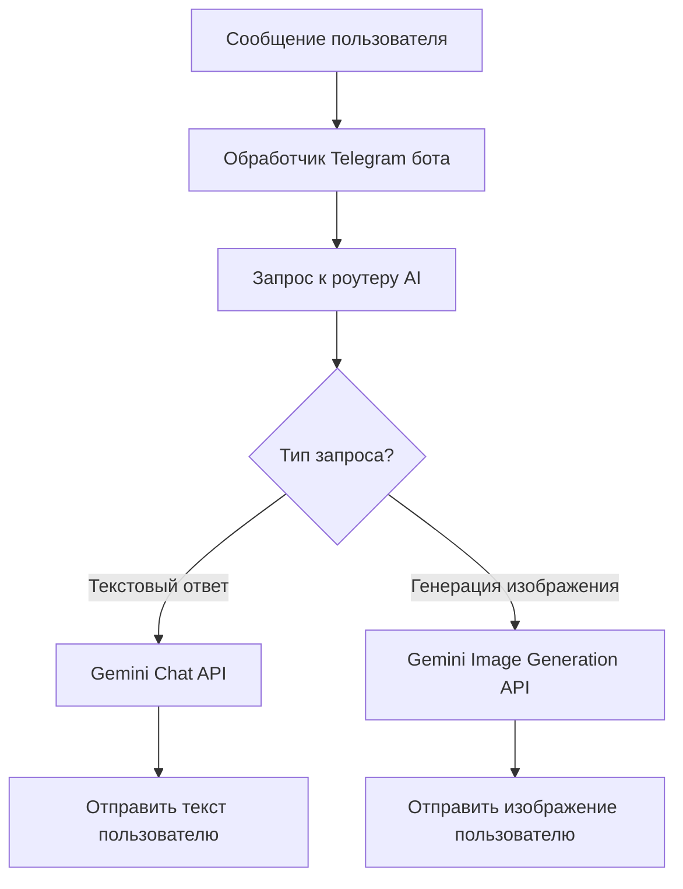

+++
title = 'Создание AI-телеграм бота на Go с Gemini API и AWS Lambda'
date = 2024-12-19T09:00:00+03:00
draft = false
tags = ['go', 'telegram', 'gemini', 'ai', 'aws', 'lambda', 'bot']
url = '/ru/post/go-telegram-gemini-ai-bot.html'

[quiz]
  [[quiz.questions]]
    question = "Какова основная роль роутера AI в архитектуре этого бота?"
    type = "single-choice"
    [[quiz.questions.answers]]
      text = "Определить тип запроса пользователя и направить его к соответствующему обработчику"
      correct = true
    [[quiz.questions.answers]]
      text = "Генерировать изображения напрямую"
      correct = false
    [[quiz.questions.answers]]
      text = "Обрабатывать webhook запросы от Telegram"
      correct = false
  
  [[quiz.questions]]
    question = "Какой API используется для генерации изображений в этом боте?"
    type = "single-choice"
    [[quiz.questions.answers]]
      text = "Gemini Image Generation API (gemini-2.5-flash-image)"
      correct = true
    [[quiz.questions.answers]]
      text = "OpenAI DALL-E API"
      correct = false
    [[quiz.questions.answers]]
      text = "Stable Diffusion API"
      correct = false
  
  [[quiz.questions]]
    question = "Какое основное преимущество деплоя бота как AWS Lambda функции?"
    type = "multiple-choice"
    [[quiz.questions.answers]]
      text = "Serverless архитектура"
      correct = true
    [[quiz.questions.answers]]
      text = "Автоматическое масштабирование"
      correct = true
    [[quiz.questions.answers]]
      text = "Экономическая эффективность"
      correct = true
    [[quiz.questions.answers]]
      text = "Требует ручного управления сервером"
      correct = false
  
  [[quiz.questions]]
    question = "Какой паттерн позволяет легко расширять функциональность для новых типов запросов, таких как генерация голоса или видео?"
    type = "single-choice"
    [[quiz.questions.answers]]
      text = "Паттерн роутера"
      correct = true
    [[quiz.questions.answers]]
      text = "Паттерн Singleton"
      correct = false
    [[quiz.questions.answers]]
      text = "Паттерн Factory"
      correct = false
  
  [[quiz.questions]]
    question = "Почему AWS S3 используется для хранения истории разговоров в Lambda-боте?"
    type = "single-choice"
    [[quiz.questions.answers]]
      text = "Lambda функции не имеют состояния, поэтому требуется внешнее хранилище"
      correct = true
    [[quiz.questions.answers]]
      text = "S3 быстрее чем база данных"
      correct = false
    [[quiz.questions.answers]]
      text = "S3 предоставляет встроенную индексацию"
      correct = false
  
  [[quiz.questions]]
    question = "Как хранятся разговоры в S3?"
    type = "single-choice"
    [[quiz.questions.answers]]
      text = "Каждый разговор как JSON файл, ключ - ID чата"
      correct = true
    [[quiz.questions.answers]]
      text = "Все разговоры в одном файле"
      correct = false
    [[quiz.questions.answers]]
      text = "В виде бинарных данных"
      correct = false
  
  [[quiz.questions]]
    question = "Какое время холодного старта у Lambda функций на Go?"
    type = "single-choice"
    [[quiz.questions.answers]]
      text = "Обычно менее 100 мс"
      correct = true
    [[quiz.questions.answers]]
      text = "Около 1 секунды"
      correct = false
    [[quiz.questions.answers]]
      text = "Более 5 секунд"
      correct = false
  
  [[quiz.questions]]
    question = "Какая модель оплаты используется в AWS Lambda?"
    type = "single-choice"
    [[quiz.questions.answers]]
      text = "Оплата за фактическое время выполнения"
      correct = true
    [[quiz.questions.answers]]
      text = "Фиксированная месячная плата"
      correct = false
    [[quiz.questions.answers]]
      text = "Оплата за выделенные ресурсы"
      correct = false
  
  [[quiz.questions]]
    question = "Что включает бесплатный тариф AWS Lambda?"
    type = "multiple-choice"
    [[quiz.questions.answers]]
      text = "1 миллион запросов в месяц"
      correct = true
    [[quiz.questions.answers]]
      text = "400,000 GB-секунд вычислительного времени в месяц"
      correct = true
    [[quiz.questions.answers]]
      text = "Неограниченное количество запросов"
      correct = false
  
  [[quiz.questions]]
    question = "Как работает интеграция Telegram бота с Lambda?"
    type = "single-choice"
    [[quiz.questions.answers]]
      text = "Через webhook, который отправляет события в Lambda через API Gateway"
      correct = true
    [[quiz.questions.answers]]
      text = "Через постоянное соединение"
      correct = false
    [[quiz.questions.answers]]
      text = "Через polling каждую секунду"
      correct = false
  
  [[quiz.questions]]
    question = "Зачем нужна история сообщений для AI бота?"
    type = "multiple-choice"
    [[quiz.questions.answers]]
      text = "Для понимания контекста разговора"
      correct = true
    [[quiz.questions.answers]]
      text = "Для поддержания связности диалога"
      correct = true
    [[quiz.questions.answers]]
      text = "Для запоминания ранее обсуждаемых тем"
      correct = true
    [[quiz.questions.answers]]
      text = "Для увеличения скорости ответа"
      correct = false
  
  [[quiz.questions]]
    question = "Откуда берутся API ключи для бота (Telegram токен и Gemini API ключ)?"
    type = "single-choice"
    [[quiz.questions.answers]]
      text = "Из переменных окружения Lambda функции"
      correct = true
    [[quiz.questions.answers]]
      text = "Хардкодятся в коде"
      correct = false
    [[quiz.questions.answers]]
      text = "Из конфигурационного файла в S3"
      correct = false
  
  [[quiz.questions]]
    question = "Какой тип запроса возвращает роутер для обычного текстового диалога?"
    type = "single-choice"
    [[quiz.questions.answers]]
      text = "RequestTypeText с полем message"
      correct = true
    [[quiz.questions.answers]]
      text = "RequestTypeImage с полем prompt"
      correct = false
    [[quiz.questions.answers]]
      text = "RequestTypeVoice"
      correct = false
  
  [[quiz.questions]]
    question = "Почему Lambda функции идеально подходят для Telegram ботов?"
    type = "multiple-choice"
    [[quiz.questions.answers]]
      text = "Событийно-ориентированная архитектура соответствует webhook модели"
      correct = true
    [[quiz.questions.answers]]
      text = "Stateless дизайн соответствует архитектуре ботов на основе webhook"
      correct = true
    [[quiz.questions.answers]]
      text = "Автоматическое масштабирование для обработки всплесков трафика"
      correct = true
    [[quiz.questions.answers]]
      text = "Требуют постоянного подключения к интернету"
      correct = false
  
  [[quiz.questions]]
    question = "Что происходит при обработке сообщения с учётом истории разговора?"
    type = "single-choice"
    [[quiz.questions.answers]]
      text = "Загружается история из S3, добавляется новое сообщение, отправляется полный контекст в Gemini, сохраняется обновлённый разговор обратно в S3"
      correct = true
    [[quiz.questions.answers]]
      text = "История загружается один раз при старте Lambda"
      correct = false
    [[quiz.questions.answers]]
      text = "История хранится в памяти Lambda функции"
      correct = false
+++

В этой статье мы рассмотрим, как создать интеллектуального Telegram бота на Go, который выступает в роли прокси между пользователями и API Google Gemini. Бот будет выполнять две основные функции: отвечать на сообщения пользователей и генерировать изображения. Хотя этот механизм может быть существенно расширен дополнительными возможностями, такими как генерация голоса и видео, мы сосредоточимся на этих двух типах запросов для простоты.

<!--more-->

## Обзор архитектуры

Бот использует интеллектуальный механизм маршрутизации, где первый запрос к AI действует как роутер для определения типа запроса пользователя. AI инструктируется либо вернуть обычный ответ в виде диалога, либо структурированный вывод, который может быть передан специализированной модели для генерации изображений.



## Структура проекта

Начнём с настройки базовой структуры проекта:

```go
package main

import (
    "bytes"
    "context"
    "encoding/json"
    "fmt"
    "os"
    
    "github.com/aws/aws-sdk-go-v2/aws"
    "github.com/aws/aws-sdk-go-v2/service/s3"
    tgbotapi "github.com/go-telegram-bot-api/telegram-bot-api/v5"
    "google.golang.org/api/option"
    "google.golang.org/api/generativeai"
)
```

## Конфигурация

Сначала нам нужно настроить бота с API ключами:

```go
type Config struct {
    TelegramToken string
    GeminiAPIKey  string
}

func loadConfig() *Config {
    return &Config{
        TelegramToken: os.Getenv("TELEGRAM_TOKEN"),
        GeminiAPIKey:  os.Getenv("GEMINI_API_KEY"),
    }
}
```

## Реализация роутера

Роутер использует Gemini для анализа сообщения пользователя и определения соответствующего действия:

```go
type RequestType string

const (
    RequestTypeText  RequestType = "text"
    RequestTypeImage RequestType = "image"
)

type RouterResponse struct {
    Type    RequestType `json:"type"`
    Prompt  string      `json:"prompt,omitempty"`
    Message string      `json:"message,omitempty"`
}
```

Промпт роутера должен быть лаконичным и понятным:

```
Вы роутер запросов для Telegram бота. Анализируйте сообщения пользователей и отвечайте JSON:
- Если пользователь хочет сгенерировать изображение, верните: {"type":"image","prompt":"описание"}
- В противном случае верните: {"type":"text","message":"ваш ответ"}
```

Вот реализация роутера:

```go
func routeRequest(ctx context.Context, client *generativeai.Client, 
                  userMsg string) RouterResponse {
    model := client.GenerativeModel("gemini-3-pro-preview")
    model.SystemInstruction = "Маршрутизируйте запросы: возвращайте JSON с типом и prompt/message"
    
    resp, _ := model.GenerateContent(ctx, userMsg)
    var routerResp RouterResponse
    json.Unmarshal([]byte(resp.Text), &routerResp)
    return routerResp
}
```

## Обработка сообщений

Вот как мы обрабатываем входящие сообщения Telegram:

```go
func handleMessage(ctx context.Context, bot *tgbotapi.BotAPI, 
                   client *generativeai.Client, update tgbotapi.Update) {
    userMsg := update.Message.Text
    
    routerResp := routeRequest(ctx, client, userMsg)
    
    switch routerResp.Type {
    case RequestTypeImage:
        generateAndSendImage(ctx, bot, client, update, routerResp.Prompt)
    case RequestTypeText:
        sendTextResponse(bot, update, routerResp.Message)
    }
}
```

## Обработчик текстовых ответов

Для обычных текстовых ответов мы используем chat API Gemini:

```go
func sendTextResponse(bot *tgbotapi.BotAPI, 
                      update tgbotapi.Update, message string) {
    msg := tgbotapi.NewMessage(update.Message.Chat.ID, message)
    msg.ReplyToMessageID = update.Message.MessageID
    bot.Send(msg)
}
```

## Обработчик генерации изображений

Для генерации изображений мы вызываем endpoint генерации изображений Gemini:

```go
func generateAndSendImage(ctx context.Context, bot *tgbotapi.BotAPI,
                          client *generativeai.Client, 
                          update tgbotapi.Update, prompt string) {
    model := client.GenerativeModel("gemini-2.5-flash-image")
    resp, err := model.GenerateContent(ctx, prompt)
    if err != nil {
        sendTextResponse(bot, update, "Ошибка генерации изображения")
        return
    }
    photo := tgbotapi.NewPhoto(update.Message.Chat.ID, 
                               tgbotapi.FileBytes{
                                   Name: "image.png",
                                   Bytes: resp.ImageData,
                               })
    bot.Send(photo)
}
```

## Главный цикл бота

Функция main настраивает бота и начинает прослушивание:

```go
func main() {
    cfg := loadConfig()
    bot, _ := tgbotapi.NewBotAPI(cfg.TelegramToken)
    client, _ := generativeai.NewClient(context.Background(),
        option.WithAPIKey(cfg.GeminiAPIKey))
    
    u := tgbotapi.NewUpdate(0)
    updates := bot.GetUpdatesChan(u)
    for update := range updates {
        if update.Message != nil {
            go handleMessage(context.Background(), bot, client, update)
        }
    }
}
```

## Примеры системных промптов

Вот лаконичные системные промпты для различных сценариев:

**Промпт роутера:**
```
Маршрутизируйте запросы пользователей: возвращайте JSON с "type":"image" и "prompt" для запросов изображений,
или "type":"text" с "message" для разговоров.
```

**Промпт ассистента для чата:**
```
Вы полезный ассистент. Предоставляйте ясные, лаконичные ответы на вопросы пользователей.
```

**Шаблон промпта для генерации изображений:**
```
Сгенерируйте высококачественное изображение на основе: {user_prompt}
```

## Расширяемость

Эта архитектура может быть легко расширена для поддержки дополнительных возможностей:

- **Генерация голоса**: Добавьте `RequestTypeVoice` и используйте text-to-speech API
- **Генерация видео**: Добавьте `RequestTypeVideo` и интегрируйте сервисы генерации видео
- **Мультимодальный ввод**: Обрабатывайте изображения, голосовые сообщения и документы от пользователей

Паттерн роутера позволяет добавлять новые типы запросов без изменения основной логики обработки сообщений.

## История сообщений и управление контекстом

Для того чтобы бот понимал контекст и поддерживал связные диалоги, ему необходим доступ к истории сообщений. Поскольку Lambda функции не имеют состояния, нам нужно внешнее хранилище для истории разговоров. AWS S3 отлично подходит для этой цели, так как он легко интегрируется с Lambda и предоставляет надёжное, масштабируемое хранилище.

### Почему важна история сообщений

AI модели, такие как Gemini, работают значительно лучше, когда у них есть доступ к контексту разговора. Без истории каждое сообщение обрабатывается независимо, что делает невозможным для бота:
- Помнить ранее обсуждаемые темы
- Ссылаться на предыдущие части разговора
- Поддерживать личность и последовательность
- Предоставлять контекстные ответы на основе предпочтений пользователя

### Хранение разговоров в S3

Мы можем хранить каждый разговор как JSON файл в S3, используя ID чата в качестве ключа. Этот подход позволяет нам:
- **Изолировать разговоры**: История чата каждого пользователя хранится отдельно
- **Легкая загрузка**: Загрузить всю историю разговора одним S3 GET запросом
- **Экономичность**: Хранение в S3 крайне дёшево для текстовых данных
- **Масштабируемость**: S3 обрабатывает миллионы разговоров без деградации производительности

Вот как реализовать хранение разговоров:

```go
func saveConversation(ctx context.Context, s3Client *s3.Client, 
                     chatID int64, messages []Message) error {
    key := fmt.Sprintf("conversations/%d.json", chatID)
    data, _ := json.Marshal(messages)
    
    _, err := s3Client.PutObject(ctx, &s3.PutObjectInput{
        Bucket: aws.String("bot-conversations"),
        Key:    aws.String(key),
        Body:   bytes.NewReader(data),
    })
    return err
}
```

Загрузка истории разговора:

```go
func loadConversation(ctx context.Context, s3Client *s3.Client, 
                     chatID int64) ([]Message, error) {
    key := fmt.Sprintf("conversations/%d.json", chatID)
    resp, err := s3Client.GetObject(ctx, &s3.GetObjectInput{
        Bucket: aws.String("bot-conversations"),
        Key:    aws.String(key),
    })
    if err != nil {
        return []Message{}, nil // Вернуть пустой, если не найдено
    }
    defer resp.Body.Close()
    
    var messages []Message
    json.NewDecoder(resp.Body).Decode(&messages)
    return messages, nil
}
```

При обработке сообщения загрузите историю, добавьте новое сообщение, отправьте полный контекст в Gemini и сохраните обновлённый разговор обратно в S3. Это обеспечивает поддержку контекста ботом в нескольких взаимодействиях, используя при этом stateless архитектуру Lambda.

## Деплой на AWS Lambda

Деплой этого бота как AWS Lambda функции предоставляет несколько значительных преимуществ по сравнению с традиционными серверными решениями. Давайте разберём, почему Lambda особенно хорошо подходит для Telegram ботов:

### Почему Lambda выгоден для Telegram ботов

**1. Экономическая эффективность**
- **Модель оплаты за использование**: Вы платите только за фактическое время выполнения вашего бота. Если ваш бот получает 1000 сообщений в день, вы платите за обработку этих 1000 сообщений, а не за работу сервера 24/7.
- **Нет затрат на простой**: В отличие от традиционного сервера, который работает постоянно (стоит денег даже в простое), Lambda функции потребляют ресурсы только при обработке запросов.
- **Бесплатный тариф**: AWS Lambda предлагает щедрый бесплатный тариф (1 миллион запросов и 400,000 GB-секунд вычислительного времени в месяц), что часто достаточно для небольших и средних ботов.

**2. Автоматическое масштабирование**
- **Обработка всплесков трафика**: Если ваш бот внезапно получает сотни сообщений одновременно (вирусный момент, маркетинговая кампания), Lambda автоматически масштабируется для обработки нагрузки без ручного вмешательства.
- **Не нужно планировать мощность**: Вам не нужно оценивать серверную мощность или беспокоиться о выделении ресурсов. Lambda делает это автоматически.
- **Параллельные выполнения**: Lambda может обрабатывать тысячи параллельных запросов, что делает её идеальной для ботов с непредсказуемыми паттернами трафика.

**3. Нулевое управление инфраструктурой**
- **Нет обслуживания серверов**: Не нужно устанавливать обновления операционной системы, управлять обновлениями безопасности или мониторить состояние сервера.
- **Простота деплоя**: Разверните вашего бота как простой ZIP файл - не нужно настраивать веб-серверы, обратные прокси или балансировщики нагрузки.
- **Встроенный мониторинг**: AWS CloudWatch автоматически отслеживает вызовы функций, ошибки и метрики производительности.

**4. Высокая доступность и надёжность**
- **Развёртывание в нескольких зонах доступности**: Lambda функции автоматически работают в нескольких зонах доступности, обеспечивая встроенную избыточность.
- **Автоматические повторы**: Lambda может автоматически повторять неудачные вызовы, повышая надёжность.
- **Нет единой точки отказа**: В отличие от одного сервера, распределённая природа Lambda устраняет единые точки отказа.

**5. Идеальное соответствие архитектуре webhook**
- **Событийно-ориентированная**: Telegram боты работают через webhook, которые по своей природе событийно-ориентированы - именно то, для чего предназначена Lambda.
- **Быстрый холодный старт**: Lambda функции на Go имеют минимальное время холодного старта (обычно менее 100 мс), обеспечивая быстрые времена отклика.
- **Без состояния**: Lambda функции по дизайну не имеют состояния, что идеально соответствует архитектуре ботов на основе webhook.

**6. Преимущества разработки и деплоя**
- **Контроль версий**: Легко развернуть разные версии и откатиться при необходимости.
- **Изоляция окружений**: Каждая Lambda функция может иметь свои переменные окружения и конфигурацию.
- **Интеграция с экосистемой AWS**: Легкая интеграция с другими сервисами AWS (S3 для хранения файлов, DynamoDB для управления состоянием и т.д.), если нужно расширить функциональность.

Для Telegram бота с переменными паттернами трафика, которому не нужна постоянная доступность, Lambda обеспечивает оптимальный баланс стоимости, производительности и операционной простоты.

## Детальная инструкция по деплою

Детальные инструкции по настройке AWS CLI, созданию Lambda функции, настройке Function URL и автоматизации деплоя вынесены в отдельную статью: **[Деплой Telegram бота на AWS Lambda с Function URL](/ru/post/go-telegram-bot-aws-lambda-deploy.html)**.

В этой статье вы найдёте:
- Настройку AWS CLI и аутентификацию (SSO и IAM)
- Пошаговое создание Lambda функции через AWS CLI
- Настройку Lambda Function URL для Telegram webhook
- Автоматизацию деплоя с помощью Makefile
- Мониторинг и логирование через CloudWatch
- Sequence диаграмму обработки запросов

## Заключение

Эта архитектура предоставляет гибкую основу для создания AI-телеграм ботов. Паттерн роутера позволяет легко расширять функциональность для новых возможностей, сохраняя при этом поддерживаемость кодовой базы. Деплой на AWS Lambda обеспечивает масштабируемость и экономическую эффективность для использования в продакшене.

