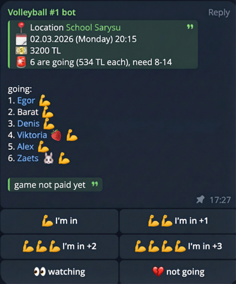

+++
title = 'How I Deployed a Telegram Bot at Zero Cost'
date = 2026-02-28T12:00:00+03:00
draft = false
tags = ['telegram', 'aws', 'lambda', 's3']
url = '/en/post/telegram-bots-zero-cost-aws.html'
featured_image = 'featured.png'

[quiz]
  [[quiz.questions]]
    question = "How many free requests does AWS Lambda Free Tier provide per month?"
    type = "single-choice"
    [[quiz.questions.answers]]
      text = "1 million requests"
      correct = true
    [[quiz.questions.answers]]
      text = "100 thousand requests"
      correct = false
    [[quiz.questions.answers]]
      text = "Unlimited"
      correct = false

  [[quiz.questions]]
    question = "How do you make a Telegram webhook send only required events?"
    type = "single-choice"
    [[quiz.questions.answers]]
      text = "Set the allowed_updates parameter when registering the webhook"
      correct = true
    [[quiz.questions.answers]]
      text = "Configure filters in AWS API Gateway"
      correct = false
    [[quiz.questions.answers]]
      text = "Enable Privacy Mode"
      correct = false

  [[quiz.questions]]
    question = "Which patterns help minimize the number of AWS S3 requests?"
    type = "multiple-choice"
    [[quiz.questions.answers]]
      text = "Lazy initialization (read only when needed)"
      correct = true
    [[quiz.questions.answers]]
      text = "Optimistic locking and save batching"
      correct = true
    [[quiz.questions.answers]]
      text = "Caching the whole S3 bucket in memory"
      correct = false
+++

For over three years, I have been organizing volleyball games in our Telegram community. At first, we used standard Telegram polls, but the routine kept growing, so I decided to automate the process. That is how an AI-powered organizer bot was born, and the whole architecture is built around it.

In this article, I will explain how this bot is designed, how I deployed it to AWS, and how I brought infrastructure cost down to zero by using AWS Free Tier and optimizing the app architecture. I have several similar bots for personal use and small communities. They all use the same techniques described below.

<!--more-->

## Organizer Bot Lifecycle

Before diving into hosting details, here is a quick overview of what the bot actually does. Its lifecycle consists of several stages:

1. **Creating a game poll with AI:** In chat, I can send a simple message asking the bot to create a game poll (for example, "let's play on Saturday"). In the system prompt (via Gemini API), the bot already knows where and when we usually play, so even a short hint is enough. It fills in time, location, pricing, and other details automatically, builds a poll-style message with action buttons, and posts it to the same chat/topic.



2. **Changing game parameters on request:** Over time, Telegram polls became limiting: changing a vote is inconvenient, you cannot vote for someone else, there is a 10-option limit, and the poll itself cannot be edited. But game state can change (payment received, game canceled, and so on). So I added an edit mode: with a regular chat message, the bot updates participants, payment status, and other game fields.

3. **Voting:** Participants tap buttons to join the game. AI is not involved at this stage - button clicks only update game state in cloud storage. Since we rent sports halls, the cost is split equally among participants. During voting, the bot recalculates per-person cost, sends updates to the chat, and keeps the main poll message up to date.

4. **Poll checks:** Several times per day, a scheduled task scans upcoming games and checks participant count. Every game has minimum and maximum thresholds. If there are not enough people, the bot asks AI to generate a motivating message. If enough people have joined, it sends a regular reminder. If there are too many participants, it alerts the organizer.

5. **Game completion:** After a game ends, if it did not reach the required participant count and was not canceled, the bot sends a thank-you message and reminds participants about payment details.

6. **Payment automation:** This is the most interesting part. When someone transfers money to my account for hall rent, a scheduled Lambda function checks my mailbox (via Gmail API) for bank transfer notifications. The bot posts a successful payment update to chat, and AI tries to match the payer name from the bank receipt with a Telegram username, then marks payment status in game storage automatically.

All this logic requires compute, storage, and background jobs. But I wanted the infrastructure to stay completely free.

## Project Architecture

The project is written in **Go** and consists of several components:
1. **Telegram Webhook Lambda** - the main function that handles incoming Telegram messages and poll button clicks.
2. **Cron Lambdas** - background jobs (for example, mail polling, pre-game and post-game notifications).
3. **AWS S3** - bot state storage (game data, participants, message history, and so on).

Instead of clicking everything manually in the AWS console or scripting with **AWS CLI**, I used **Terraform**. It lets me define infrastructure as declarative code: Lambdas, Lambda schedules (EventBridge), IAM roles and access policies, and S3 buckets. I maintain two environments: `dev` and `prod`. A full environment can be provisioned from scratch with a single `terraform apply` command in a few minutes.

## AWS Lambda Instead of a Persistent Server

The first and most important cost-saving step was replacing a constantly running server (a $2-$5/month VPS) with serverless compute. All bot components are deployed as **Lambda functions**.

AWS Lambda has a very generous free tier that is available continuously, not only for the first year:
- **1,000,000 free requests** per month.
- **400,000 GB-seconds** of compute time per month.

Communication with the bot works through a Telegram webhook: when a user sends a message, Telegram makes an HTTP request to the Function URL, Lambda starts, processes the message, responds, and "goes to sleep" again. With these limits, my function execution cost remains zero. For background tasks, I use **Amazon EventBridge** to trigger Lambdas on schedule.

## How AI Works in My Bot

AI acts as a router in this bot: based on an incoming message, it determines what the user wants and returns a strictly structured result.

I use prompts for three request types:
1. **Create a game poll** (date, time, location, limits, price, etc.).
2. **Modify an existing game** (add/remove participant, mark payment, cancel game, and so on).
3. **Regular conversation** (when no game action is needed).

For each type, the system prompt defines its own JSON format. AI must return only one of three JSON variants depending on the situation. Then the code parses that JSON into the matching Go structure and decides what to do next: create a game, update a game, or send a regular text reply.

### Context and model

AI gets context from the latest 50 bot-related messages in each chat (mentions of the bot username or replies to bot messages). This history is stored in a separate S3 bucket as a JSON array and then decoded into a Gemini-friendly structure.

The bot did not always run on Gemini - I originally used ChatGPT. Later I switched to Gemini because Google's offering became more attractive: a free tier for Flash models and a more convenient API.
Right now the model is `gemini-3-flash-preview`.

### More "human" responses

To avoid robotic replies, different Lambda functions generate varied texts from templates. For example, after a game ends, the bot sends a summary message and sometimes adds a short joke (usually not very funny).

### AI for payment recognition

AI is also used in payment recognition. The flow is: someone from the team (usually me) pays for the hall, then after the game the total is split by the actual number of players, and everyone transfers their share to the person who paid. The bank sends incoming transfer notifications to my Gmail inbox, and a separate scheduled Lambda reads those emails through Gmail API using filtered queries.

Then AI receives a specialized request: based on the participant list and payment description, it must detect the most likely payer and return a confidence score from `0` to `1`. If confidence is `>= 0.6`, the payment is considered matched: the participant is marked as paid in game data, and the actual paid amount is saved (important because people sometimes underpay or overpay).

One more context detail: if there is an active game poll in a chat, AI always receives full game data in its system prompt.

### Response formatting

One practical detail: models tend to output Markdown by default, but Telegram `MarkdownV2` is fragile and often breaks on unescaped symbols. So I explicitly instruct the model to format replies in HTML (`<b>`, `<i>`, `<code>`), which significantly reduces formatting errors.

## Optimizing Telegram Interaction

Even with 1 million monthly calls, those calls should be used carefully. I reduced Lambda wake-ups as much as possible by configuring Telegram itself.

### 1. Webhook update filtering (`allowed_updates`)

When you set a webhook URL for a Telegram bot, Telegram sends all update types by default: bot added to channel, chat status changes, edited messages, and so on. Each event wakes up Lambda and spends your free quota.

I fixed this by explicitly listing only relevant event types. In `setWebhook`, I pass `allowed_updates` and limit updates to new messages and inline button presses.

Webhook setup example with `curl`:

```bash
curl -X POST "https://api.telegram.org/bot<YOUR_BOT_TOKEN>/setWebhook" \
  -H "Content-Type: application/json" \
  -d '{
    "url": "https://<your-lambda-url>",
    "allowed_updates": ["message", "callback_query"]
  }'
```

More details about `allowed_updates` are available in the [official Telegram Bot API docs](https://core.telegram.org/bots/api#setwebhook).

Now Telegram filters "noise" on its side, and my function runs only for meaningful events.

Also, keep HTTP status behavior in mind: for Telegram, only `2xx` means successful delivery. If your function returns `4xx/5xx` or times out, Telegram will retry the update many times. That is why the handler should be idempotent and return `200 OK` quickly, otherwise you can easily create a retry loop.

At the time I built this bot, the most popular Go Telegram bot library did not support forum topics, while our chat relies on topics heavily. So I forked it and added topic support in my version: [github.com/antelman107/telegram-bot-api](https://github.com/antelman107/telegram-bot-api).

### 2. Privacy Mode

Many users add bots to group chats. Without proper configuration, a bot can receive updates for *every* message posted by anyone in the group. This can burn through your Lambda quota very quickly.

To avoid that, I enabled **Privacy Mode** via `@BotFather`. With this setting, bots do not receive updates for messages that are not directed to them. The bot reacts only to slash commands (`/`) or explicit mentions (`@BotName`).

## State Storage in AWS S3

Telegram bots need to store conversation context and user settings. Using a classic database (for example, RDS) for this can be too expensive.

Instead, I store bot state as regular files in **AWS S3**. S3 also has a good **Free Tier** (valid for the first 12 months for new accounts):
- **5 GB** of Standard storage.
- **20,000 GET requests** per month.
- **2,000 PUT, COPY, POST, or LIST requests** per month.

Even after the 12-month free tier ends, S3 pricing for typical Telegram bots remains tiny (prices can vary by region; numbers below are for `us-east-1`):
- Data storage: **~$0.023 per 1 GB/month**. Bot state files usually occupy only a few megabytes (less than a cent per month).
- Write requests (PUT): **$0.005 per 1,000 requests**.
- Read requests (GET): **$0.0004 per 1,000 requests**.

So even if your bots make, say, 10,000 writes and 50,000 reads per month after the first year (I still do not reach that across all my bots), it is about $0.07/month. That is still practically "zero cost" compared to renting any server.

Still, in the first year the main bottleneck is the **2,000 PUT request** limit. If the bot saves state after every message, this limit is reached very quickly. Extra requests are billed (those same half-cent per thousand writes).

### Minimizing S3 Requests

To stay within free limits and reduce S3 calls, I use two main patterns:

1. **Lazy Initialization:**
   The bot does not read state from S3 on every request. State is loaded *only* when a user command actually needs context checks or modifications. If a user sends a simple command like `/help`, the bot answers instantly without any S3 GET requests.

2. **Optimistic Locking and ETag:**
   When state changes in memory, the bot does not immediately write to S3. Save happens only at the end of request processing. Using optimistic locking, the bot compares the updated state with the original one.

   In S3, this works well with **ETag** (Entity Tag). ETag is a content hash (usually MD5) that S3 returns in response headers for each GET request.

   The workflow:
   - On state read (GET), the bot stores the current file ETag.
   - During request handling, state can be modified in memory.
   - Before saving, the bot serializes new state to JSON and computes its hash. If the new hash equals the original one, there are no real changes (even if in-memory objects were recreated), so the PUT request is **skipped** to save quota.
   - If state changed, the bot sends PUT with original ETag in `If-Match` (available in S3 under certain versioning setups, or emulated logically). This protects from race conditions when two Lambdas try to save state at the same time. The first write succeeds (ETag changes), the second gets an ETag mismatch and does not overwrite newer data, then can re-read state or skip save.

## Conclusion

Moving bots to a serverless stack fully paid off. Infrastructure on AWS Lambda + S3 + Terraform runs fast, does not require server maintenance, and in my case stays around ~$0 per month.

AI plays a central role in this system: it routes incoming requests (create game, edit game, or regular chat), helps recognize payments from bank notifications with confidence scoring, and makes messages feel more alive through varied generation. Combined with Telegram webhook filtering (`allowed_updates`), idempotent request handling, topic support, and efficient S3 state management (lazy loading + ETag), the bot evolved from a simple "poll button" into an autonomous game organizer assistant.
