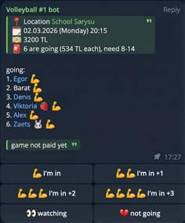

+++
title = 'Как я задеплоил Telegram-бота c ИИ в AWS забесплатно'
date = 2026-02-28T12:00:00+03:00
draft = false
tags = ['telegram', 'aws', 'lambda', 's3', 'ai']
url = '/ru/post/telegram-bots-zero-cost-aws.html'
featured_image = 'featured.png'

[quiz]
  [[quiz.questions]]
    question = "Какой объем бесплатных запросов предоставляет AWS Lambda (Free Tier) ежемесячно?"
    type = "single-choice"
    [[quiz.questions.answers]]
      text = "1 миллион запросов"
      correct = true
    [[quiz.questions.answers]]
      text = "100 тысяч запросов"
      correct = false
    [[quiz.questions.answers]]
      text = "Неограниченно"
      correct = false

  [[quiz.questions]]
    question = "Как заставить вебхук Telegram отправлять только нужные события?"
    type = "single-choice"
    [[quiz.questions.answers]]
      text = "Указать параметр allowed_updates при регистрации вебхука"
      correct = true
    [[quiz.questions.answers]]
      text = "Настроить фильтры в AWS API Gateway"
      correct = false
    [[quiz.questions.answers]]
      text = "Использовать Privacy Mode"
      correct = false

  [[quiz.questions]]
    question = "Какие паттерны помогают минимизировать количество запросов к AWS S3?"
    type = "multiple-choice"
    [[quiz.questions.answers]]
      text = "Ленивая инициализация (чтение только при необходимости)"
      correct = true
    [[quiz.questions.answers]]
      text = "Оптимистичные блокировки и батчинг сохранений"
      correct = true
    [[quiz.questions.answers]]
      text = "Кэширование всего S3 бакета в оперативной памяти"
      correct = false

  [[quiz.questions]]
    question = "Как бот хранит устоявшиеся нормы чата (зал, расписание, IBAN)?"
    type = "single-choice"
    [[quiz.questions.answers]]
      text = "Как факты с ключами в отдельном файле chat memory в S3, отдельно от истории сообщений"
      correct = true
    [[quiz.questions.answers]]
      text = "Только в последних 50 сообщениях чата"
      correct = false
    [[quiz.questions.answers]]
      text = "Навсегда зашиты в системный промпт"
      correct = false

  [[quiz.questions]]
    question = "Как webhook обрабатывает сообщение в чате?"
    type = "single-choice"
    [[quiz.questions.answers]]
      text = "Google ADK LlmAgent с tools, которые сразу пишут в Telegram и S3, а результат возвращается модели для следующих раундов"
      correct = true
    [[quiz.questions.answers]]
      text = "Один JSON на сообщение, который Go разбирает один раз, без возврата результата tools модели"
      correct = false
    [[quiz.questions.answers]]
      text = "Только нативные slash-команды Telegram Bot API"
      correct = false
+++

Уже больше трех лет я организую игры в нашем волейбольном комьюнити, которое живет в Telegram. Сначала мы использовали обычные встроенные опросы, но рутины становилось все больше, и я решил автоматизировать процесс. Так родился бот-организатор с искусственным интеллектом, вокруг которого и выстроена вся архитектура.


<!--more-->


В этой статье я расскажу о том, как организован такой бот, как я задеплоил в облако AWS и достиг нулевой цены за инфраструктуру, используя возможности AWS Free Tier и оптимизируя архитектуру приложения.
У меня есть несколько подобных ботов, используемых в личных целях или для небольших комьюнити. 
Все они используют описанные ниже техники.

## Жизненный цикл бота-организатора

Прежде чем переходить к техническим деталям хостинга, кратко опишу, что именно делает бот. Его жизненный цикл состоит из нескольких этапов:

1. **Создание опроса через ИИ:** В чате можно написать боту обычное сообщение с просьбой создать опрос на игру (например, "давайте соберемся в субботу"). Устоявшиеся нормы группы живут в долговременной памяти чата (зал, обычные дни и время, цена, известные IBAN), поэтому боту достаточно лишь намека. Gemini добирает остальное из этой памяти, формирует сообщение со всеми данными игры, добавляет кнопки для ответов и отправляет в тот чат и топик, в котором его об этом попросили.

2. **Изменение параметров игры по запросу:** Со временем стало ясно, что опросы Telegram неудобны: сложно поменять выбор, нельзя голосовать за другого, максимум 10 вариантов и нельзя редактировать сам опрос. А статус игры может меняться (оплата, отмена и т.д.). Поэтому у бота появился режим редактирования: по обычному сообщению в чате он обновляет участников, оплаты и другие данные игры.

3. **Голосование:** Участники нажимают на кнопки, записываясь на игру. На этом этапе ИИ не задействуется — нажатия кнопок просто обновляют состояние (стейт) игры в облачном хранилище. Наши игры проходят в платно арендуемых залах, стоимость аренды распределяется равно между всеми участниками. При голосовании бот считает сумму на одного участника и отправляет сообщения с апдейтами. Кроме отправки сообщений, основное сообщение-опрос, также обновляется всей актуальной информацией.

4. **Проверки опроса:** Несколько раз в день по расписанию перебираются все предстоящие игры и проверяется количество участников. У каждой игры есть минимальный и максимальный порог. Если людей не хватает, бот через ИИ генерирует мотивирующее сообщение в чат. Если людей достаточно, отправляет стандартное напоминание. Если случился перебор — обращает на это внимание организатора.

5. **Завершение игры:** После окончания времени игры, если игра набрала нужное число участников и не была отменена, отправляется сообщение с благодарностью участникам в котором также напоминается об оплате и скидывают реквизиты для оплаты.

6. **Автоматизация оплат:** Самая интересная часть. Когда кто-то переводит деньги на мой счет за аренду зала, запускается периодическая лямбда-функция, которая опрашивает мой почтовый ящик (через Gmail API) на предмет писем о переводах от банка. Бот пишет в чат об успешной оплате, а ИИ пытается сопоставить имя плательщика из банковского чека с Telegram-юзернеймом участника и автоматически делает пометки об оплате в хранилище данных игры.

Вся эта логика требует вычислительных ресурсов, базы данных и фоновых задач. Но я хотел, чтобы инфраструктура была полностью бесплатной.

## Архитектура проекта

Весь проект написан на **Go** и состоит из нескольких компонентов:
1. **Telegram Webhook Lambda** — основная функция, которая обрабатывает входящие сообщения от пользователей Telegram и нажатия на кнопки в опросах.
2. **Cron Lambdas** — фоновые задачи (например, поллинг почты, уведомления перед игрой и после нее).
3. **AWS S3** — хранилище состояния бота (данные игры, кто записался на игру, недавняя история сообщений и долговременная память чата).

Чтобы не накликивать все это руками в AWS консоли или даже использовать скрипты с **AWS CLI**, я использовал **Terraform**. Это позволяет описывать всю инфраструктуру в виде декларативного кода: лямбды, расписания запуска лямбд (EventBridge), IAM-роли и политики доступа, S3 бакеты. У меня есть два окружения: `dev` и `prod`. Развернуть полностью готовую среду с нуля можно одной командой `terraform apply`, подождав несколько минут.

## AWS Lambda вместо постоянного сервера

Первый и самый главный шаг к экономии — отказаться от постоянно работающего сервера (VPS за $2–$5 в месяц) в пользу бессерверных вычислений. Все компоненты волейбольного бота задеплоены как **Lambda функции**.

У сервиса AWS Lambda есть бесплатный уровень, который доступен постоянно, а не только первый год:
- **1 000 000 (один миллион) бесплатных запросов** в месяц.
- **400 000 ГБ-секунд** вычислительного времени в месяц.

Общение с ботом работает через Telegram webhook: когда пользователь что-то пишет, Telegram делает HTTP-запрос по Function URL, AWS Lambda поднимается, обрабатывает сообщение, отвечает и "засыпает". В рамках этих огромных лимитов я не плачу за выполнение функций ни цента. Для фоновых задач я использую **Amazon EventBridge**, который дергает лямбды по расписанию.

## Как у меня работает ИИ

Webhook-чат — это небольшой агент, а не парсер JSON.

Долгое время Gemini был **роутером**: один вызов `GenerateContent`, один JSON (`new game`, `modified game`, `memory update`, `no reply` или обычный HTML). Go разбирал документ и делал побочные эффекты. Потом тот же подход переехал на function calling, но всё ещё как **одноитерационный** цикл: выполнить все tools из одного ответа и остановиться. Так нельзя сделать «создай опрос и запиши меня» — модель не видит `message_id` нового опроса.

Сейчас чат идёт через **[Google ADK for Go v2](https://pkg.go.dev/google.golang.org/adk/v2)** (`LlmAgent` + `Runner`). Runner вызывает Gemini, сразу выполняет tools против Telegram и S3, возвращает результат функции (включая `message_id` нового опроса) и даёт модели вызвать следующие tools. Я ограничиваю это **6** раундами `GenerateContent`, чтобы застрявший цикл не сорвал 60-секундный таймаут Lambda. Несколько tool-вызовов в одном ответе модели выполняются по порядку.

У агента пять tools:

1. **`create_game`** — отправить один волейбольный опрос в Telegram, сохранить в S3, вернуть `message_id`. Один вызов — одна игра; несколько вызовов закрывают неделю.
2. **`update_game`** — патч существующего опроса (нужен `message_id`): полный список участников после изменения, отмена, оплаты, время, зал. Один вызов на одну игру. После `create_game` следующий раунд может сделать `update_game` по вернувшемуся `message_id` (например, записать автора запроса).
3. **`upsert_memory`** — сохранить устоявшийся факт группы (зал, расписание, цена/время по умолчанию, IBAN, ник). Не для разовых голосов и не для состава текущей игры.
4. **`delete_memory`** — забыть факт по существующему ключу из CHAT MEMORY.
5. **`send_reply`** — одно HTML-сообщение в Telegram на весь ход. Не больше одного раза и только после create/update/memory. Для чистых реакций tool не вызывается.

Нет tools и нет текста — апдейт глотается. Если модель всё ещё отвечает JSON или HTML вместо tools, этот путь оставлен как fallback.

Периодические Lambda (сопоставление платежей, напоминания о долгах, составы команд, «живые» тексты после игры) по-прежнему делают один вызов `GenerateContent`. Им не нужен многошаговый цикл с Telegram.

### Контекст и модель

У ИИ есть контекст из последних 50 сообщений каждого чата, связанных с ботом (упоминания его ника или ответы на его сообщения). История хранится в S3 как JSON-массив, декодируется в контент Gemini и **кладётся в in-memory сессию ADK** на время этого запуска Lambda. Это *рабочее окно* диалога, а не база знаний: факты в нем протухают, и нельзя точечно обновить или забыть одну норму группы, не переписывая транскрипт.

Бот не всегда работал на Gemini — изначально я использовал ChatGPT. Позже перешел на Gemini из-за более выгодных условий от Google: бесплатного tier для моделей Flash и более удобного API.
Сейчас используется модель `gemini-3-flash-preview`.

Также важный момент контекста: если в чате есть активный опрос на игру, ИИ всегда получает полные данные по этой игре в системном промпте.
К примеру, бот может разбить участников на 2 команды по запросу, упомянуть если нужно сделать объявление.

### Динамическая память чата

Раньше устоявшиеся знания группы были зашиты в системный промпт: зал, понедельники и среды в 20:15, цена по умолчанию, известные IBAN. Это работало для одного чата и ломалось, как только появлялась вторая группа или менялся зал.

Теперь у каждого Telegram-чата своя долговременная память в S3 (`state/chat_memory.json`), отдельно от окна из 50 сообщений. Факт — это ключ в `snake_case`, человекочитаемый `text` (HTML-ссылки разрешены) и `updated_at`. Лимит — 40 фактов на чат; самый старый вытесняется, когда лимит превышен. Чтение и запись идут тем же путем, что и стейт игры: ленивый GET, очередь мутаций в памяти и CAS по ETag, так что лишний JSON-файл не раздувает квоту S3.

Gemini видит блок `CHAT MEMORY` в каждом промпте, где нужны нормы группы: создание и правка игр, обычные ответы, сопоставление платежей из банковских писем, варианты составов перед игрой и напоминания после нее. Если пользователь не указал деталь, модель берет ее из памяти, а не выдумывает зал или IBAN. Если память пустая, используются осторожные запасные значения (8–14 игроков, 20:00, пустые место и цена).

Память меняется теми же tools ADK, а не отдельным типом JSON:

1. **Явная просьба запомнить или забыть.** Если кто-то пишет «запомни», «forget» или «теперь зал вот этот», модель вызывает `upsert_memory` или `delete_memory` и может сделать `send_reply` с коротким подтверждением.
2. **Тихий вывод.** Если модель замечает устойчивую норму группы при создании игры, она может вызвать `upsert_memory` в том же ходе без отдельного «я запомнил». Разовые голоса и разовые платежи в память не попадают.

Go-обработчик нормализует ключи, применяет операции к списку фактов этого чата и один раз сохраняет стейт в конце Lambda.

Для исходного чата Volleyball #1 старые хардкод-значения один раз засеяли в память. После этого они ушли из промпта, и группа может менять их прямо в чате.

### Живость ответов

Чтобы бот не выглядел "деревянным", разные лямбды генерируют вариативные тексты по шаблонам. Например, после завершения игры бот отправляет итоговое сообщение и иногда добавляет туда небольшой анекдот (чаще всего, конечно, не очень смешной).

### ИИ в распознавании платежей

Отдельно ИИ участвует в распознавании платежей. Сценарий такой: кто-то из команды (чаще я) оплачивает аренду зала, после игры сумма делится на фактическое число игроков, и каждый переводит свою долю тому, кто оплатил аренду. Банк присылает мне письма о входящих переводах на Gmail, а отдельная периодическая Lambda читает эти письма через Gmail API с фильтрацией по нужным сообщениям.

Дальше в ИИ уходит специализированный запрос: по списку участников и описанию перевода нужно определить вероятного плательщика и вернуть уровень уверенности от `0` до `1`. Если уверенность `>= 0.6`, платеж считается распознанным: в данных игры участник отмечается как оплативший, а сумма сохраняется фактически полученная (это важно, потому что люди иногда недоплачивают или переплачивают).


### Форматирование ответов

Отдельный практический момент: по умолчанию модели любят Markdown, а Telegram с `MarkdownV2` часто ломается из-за неэкранированных символов. Поэтому я сразу инструктирую ИИ отвечать в HTML (`<b>`, `<i>`, `<code>`), и это заметно снижает количество ошибок форматирования.

### Стоимость Gemini API

На текущий момент для `gemini-3-flash-preview` действует тариф paid tier: стоимость обычно считается за входные и выходные токены (ориентир: около `$0.50` за 1M input-токенов и `$3.00` за 1M output-токенов, плюс более дешевый cached input — это повторно используемая часть переписки, которая тарифицируется по сниженной цене). Актуальные тарифы и изменения лучше смотреть в официальной таблице Google: [Gemini Developer API Pricing](https://ai.google.dev/gemini-api/docs/pricing).

По моему опыту траты на ИИ в месяц остаются небольшими, потому что запросы относительно редкие. Часто удается уложиться в бесплатный уровень Gemini API для flash-моделей, а платные вызовы нужны только в более активные периоды.


## Оптимизация взаимодействия с Telegram

Даже с лимитом в 1 миллион вызовов в месяц, их нужно расходовать экономно. Я добился максимально редкого и целевого запуска Lambda-функций, используя настройку на стороне самого Telegram.

### 1. Фильтрация обновлений вебхука (`allowed_updates`)

Когда вы устанавливаете webhook-URL для Telegram-бота, по умолчанию Telegram начинает слать вам абсолютно все события: добавление бота в канал, изменение статуса чата, редактирование сообщений и так далее. Каждое такое событие пробуждает Lambda-функцию и тратит лимит.

Я решил эту проблему путем указания конкретных событий, по которым вебхук должен отправлять сообщение. При вызове метода `setWebhook` я передаю параметр `allowed_updates`, ограничивая его приходом новых сообщений и нажатием кнопок (inline-клавиатур). 

Пример установки вебхука через `curl`:

```bash
curl -X POST "https://api.telegram.org/bot<YOUR_BOT_TOKEN>/setWebhook" \
  -H "Content-Type: application/json" \
  -d '{
    "url": "https://<your-lambda-url>",
    "allowed_updates": ["message", "callback_query"]
  }'
```

Подробнее о параметре `allowed_updates` можно прочитать в [официальной документации Telegram API](https://core.telegram.org/bots/api#setwebhook).

Теперь Telegram фильтрует "шум" на своей стороне, и моя функция запускается только по делу.

Важно учитывать HTTP-статус webhook: для Telegram успех — только `2xx`. Если функция вернула `4xx/5xx` или не ответила вовремя, Telegram будет повторять запрос много раз. Поэтому обработчик должен быть идемпотентным и быстро возвращать `200 OK`, иначе легко получить цикл из повторных запросов.

На момент разработки бота самая популярная библиотека Telegram-ботов для Go не поддерживала топики, а в нашем чате они активно используются. Поэтому я форкнул библиотеку и доработал поддержку топиков в своей версии: [github.com/antelman107/telegram-bot-api](https://github.com/antelman107/telegram-bot-api).


### 2. Режим приватности (Privacy Mode)

Многих ботов пользователи добавляют в общие групповые чаты. Без должной настройки бот будет получать апдейты о *каждом* сообщении, отправленном кем-либо в этой группе. Это может съесть миллион запросов к лямбда очень быстро.

Чтобы избежать этого, я включил **режим приватности (Privacy Mode)** у ботов через `@BotFather`. Благодаря этой настройке, боты не получают апдейтов о сообщениях, не обращенных к ним напрямую. Бот реагирует только на команды, начинающиеся со слэша (`/`), или когда его явно тегают (`@BotName`).

## Хранение состояния в AWS S3 

Telegram-ботам нужно хранить контекст диалога или пользовательские настройки. Использовать классическую базу данных (например, RDS) для таких задач слишком дорого.

Вместо этого я храню состояние ботов в виде обычных файлов в **AWS S3**. У сервиса S3 тоже есть отличный **Free Tier** (действует первые 12 месяцев для новых аккаунтов):
- **5 ГБ** стандартного хранилища (Standard storage).
- **20 000 GET-запросов** в месяц.
- **2 000 PUT, COPY, POST или LIST запросов** в месяц.

Даже когда 12-месячный Free Tier закончится, цены на S3 для типичных Telegram-ботов остаются микроскопическими (цены могут немного отличаться в зависимости от региона, ниже приведены для `us-east-1`):
- Хранение данных: **~$0.023 за 1 ГБ в месяц**. Текстовые файлы состояний ботов обычно занимают считанные мегабайты (менее цента в месяц).
- Запросы на запись (PUT): **$0.005 за 1 000 запросов**.
- Запросы на чтение (GET): **$0.0004 за 1 000 запросов**.

Таким образом, если ваши боты после первого года будут делать, например, 10 000 записей и 50 000 чтений в месяц, которых у меня до сих пор по всем бота не наберется, это обойдется вам примерно в $0.07 (7 центов) в месяц. Это все еще практически "Zero Cost" по сравнению с арендой любого сервера.

Тем не менее, в рамках первого года самым узким местом является лимит на 2 000 PUT-запросов (запись). Если бот будет сохранять состояние после каждой строчки от пользователя, этот лимит исчерпается очень быстро. Запросы сверх лимита начнут тарифицироваться (те самые полцента за тысячу запросов).

### Минимизация запросов к S3

Чтобы уложиться в бесплатные лимиты и добиться наименьшего количества запросов к S3, я использую две основные техники при работе с хранилищем:

1. **Ленивая инициализация (Lazy Initialization):**
   Бот не ходит в S3 за состоянием при каждом запросе. Стейт загружается *только* в тот момент, когда команда пользователя действительно требует проверки или изменения контекста. Если пользователь пишет простую команду вроде `/help`, бот отвечает моментально, не делая ни одного GET-запроса к S3.

2. **Оптимистичные локи (Optimistic Locking) и ETag:**
   При изменении состояния в памяти, бот не спешит делать PUT-запрос. Запись происходит строго в конце жизненного цикла обработки сообщения. С помощью оптимистичных блокировок бот сравнивает измененный стейт с исходным. 
   
   В AWS S3 для этого идеально подходит использование **ETag** (Entity Tag). ETag — это хэш содержимого файла (обычно MD5), который S3 возвращает в заголовках при каждом GET-запросе.
   
   Механика работает следующим образом:
   - При чтении состояния (GET) бот запоминает текущий ETag файла.
   - Во время обработки сообщения бот может менять состояние в оперативной памяти.
   - Перед сохранением бот сериализует новое состояние в JSON и вычисляет его хэш. Если хэш нового состояния совпадает с исходным, это значит, что данные по факту не изменились (даже если объекты в памяти пересоздавались), и PUT-запрос **просто не выполняется**, экономя лимиты.
   - Если состояние изменилось, бот отправляет PUT-запрос, передавая исходный ETag в заголовке `If-Match` (доступно в S3 при определенных настройках версионирования или эмулируется логически). Это защищает от состояния "гонки" (race condition), если пользователь быстро отправил два сообщения, и две Lambda-функции попытались сохранить состояние одновременно. Первая функция успешно обновит файл (и ETag изменится), а вторая получит ошибку несовпадения ETag и не затрет изменения первой, после чего сможет либо перечитать данные, либо просто проигнорировать запись.

## Заключение

Перевод ботов на Serverless-рельсы полностью оправдал себя. Инфраструктура на AWS Lambda + S3 + Terraform работает быстро, не требует сопровождения серверов и в моем сценарии укладывается в ~0 долларов в месяц.

Ключевую роль в этой системе играет ИИ: Google ADK ведёт чат настоящими tools (`create_game`, `update_game`, `upsert_memory`, `delete_memory`, `send_reply`), сопоставление платежей по-прежнему идёт одним JSON-вызовом с оценкой уверенности, а периодические Lambda не дают сообщениям звучать деревянно. В связке с Telegram webhook-фильтрацией (`allowed_updates`), идемпотентной обработкой, поддержкой топиков, долговременной памятью чата в S3 и экономным стейт-менеджментом (ленивая загрузка и ETag) бот вырос из простой "голосовалки" в автономного помощника для организации игр.