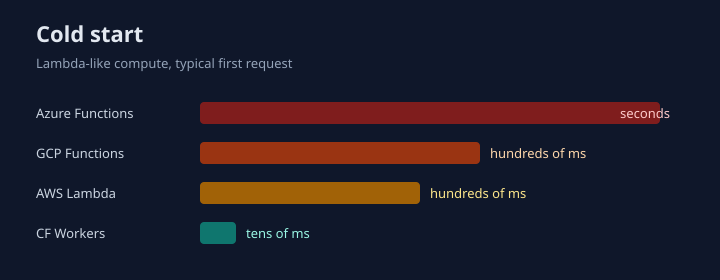

+++
title = 'From AWS Lambda to Cloudflare Workers: free tiers and cold starts'
date = 2026-09-11T23:00:00+03:00
draft = false
tags = ['telegram', 'aws', 'lambda', 's3', 'cloudflare', 'workers', 'r2', 'go']
url = '/en/post/telegram-bot-cloudflare-workers.html'
featured_image = 'featured.svg'

[quiz]
  [[quiz.questions]]
    question = "Which serverless runtime usually has the shortest cold start?"
    type = "single-choice"
    [[quiz.questions.answers]]
      text = "Cloudflare Workers (V8 isolate)"
      correct = true
    [[quiz.questions.answers]]
      text = "AWS Lambda on the provided.al2023 custom runtime"
      correct = false
    [[quiz.questions.answers]]
      text = "Azure Functions Consumption"
      correct = false

  [[quiz.questions]]
    question = "What is Cloudflare R2's always-free storage allowance?"
    type = "single-choice"
    [[quiz.questions.answers]]
      text = "10 GB per month, with no first-year expiry"
      correct = true
    [[quiz.questions.answers]]
      text = "5 GB for the first 12 months only"
      correct = false
    [[quiz.questions.answers]]
      text = "Unlimited storage"
      correct = false

  [[quiz.questions]]
    question = "Which statements about object-storage free tiers are true?"
    type = "multiple-choice"
    [[quiz.questions.answers]]
      text = "AWS S3 is generous for a year, but 2,000 PUT requests is the tight limit"
      correct = true
    [[quiz.questions.answers]]
      text = "R2 includes 1M Class A and 10M Class B operations every month"
      correct = true
    [[quiz.questions.answers]]
      text = "Azure Blob storage is included in the Azure Functions free grant"
      correct = false
+++

In the [previous article](/en/post/telegram-bots-zero-cost-aws.html) I described how I fitted a Telegram volleyball organizer bot into the AWS Free Tier: Lambda + S3 + EventBridge, at about zero dollars. That setup ran for months. Then I moved the same bot to **Cloudflare Workers** and **R2** — the same Go, the same JSON state files, the same Gemini router.

<!--more-->

Why touch something that was already free? **Cold start.** A Lambda on the `provided.al2023` custom runtime wakes up in hundreds of milliseconds after idle time, sometimes more than a second. You feel that on a Telegram webhook: the first update after a quiet stretch is slower than the next one. A Workers isolate comes up in **tens of milliseconds**. On a real deploy of this bot, Wrangler reported Worker Startup Time of **16–37 ms**.

Below is a practical comparison of AWS, GCP, Azure, and Cloudflare free tiers for the two things this bot needs: **Lambda-style compute** and **S3-style object storage**. Numbers are a snapshot for September 2026 — I always re-check the official pages before production.

## Same bot, different runtime

The product did not change: Telegram webhook, Gemini as a router, JSON state for games and chat memory, pre/after-game jobs, and a Gmail poll for rent payments.

On AWS that meant several Lambdas and EventBridge one-shots (`at(...)`) per game. On Cloudflare:

1. One Go Worker compiled to Wasm with [syumai/workers-go](https://github.com/syumai/workers-go).
2. The same object keys in **R2** that used to live in S3 (`state/game_state.json` and friends).
3. Instead of EventBridge, a JSON job calendar in R2 and a **cron every 10 minutes** that runs whatever is due.

Workers have no one-shot “wake me on 12 September at 15:30”. They also have no zoo of functions: webhook and cron are the same binary with two entrypoints.

## Compute: Lambda-like services

| | AWS Lambda | GCP Cloud Run functions | Azure Functions (Consumption) | Cloudflare Workers |
|---|---|---|---|---|
| Free invocations | **1M / month**, always free | **2M / month**, always free | **1M / month** (Consumption grant) | Free: **100,000 / day** (~3M / month). Paid: 10M / month in the $5 plan |
| Compute | 400,000 GB-s / month | 400,000 GB-s + 200,000 GHz-s | 400,000 GB-s | Free: **10 ms CPU** per invocation. Paid: 30M CPU-ms / month |
| What “duration” means | wall-clock × memory | wall-clock × memory/CPU | wall-clock × memory | **CPU time**, not HTTP wait |
| Cold start | hundreds of ms (Go custom runtime) | hundreds of ms … seconds | often **seconds** | **tens of ms** (isolate) |
| Go | native `provided.al2023` | native | custom handler | **Wasm** (`GOOS=js`) |

Sources: [AWS Lambda pricing](https://aws.amazon.com/lambda/pricing/), [Google Cloud Free Tier](https://docs.cloud.google.com/free/docs/free-cloud-features), [Azure Functions pricing](https://azure.microsoft.com/pricing/details/functions/), [Workers pricing](https://developers.cloudflare.com/workers/platform/pricing/), [Workers limits](https://developers.cloudflare.com/workers/platform/limits/).

The three hyperscalers look alike: millions of requests and hundreds of thousands of GB-seconds. That is enough for a small bot. The real difference is **how the runtime wakes up**, and whether the storage free tier expires after a year.

### Cold start

Classic Lambda boots a micro-VM, pulls a runtime, then your zip/image. For Go on `provided.al2023` that is usually **hundreds of milliseconds**. GCP Gen2 is closer to Cloud Run: better than first-gen Functions, still a container cold start. Azure Consumption is the worst of the four: after idle, the first request often lands in seconds.

Workers are not containers. They are **V8 isolates**. Cloudflare’s startup limit is one second; my Wasm worker actually started in **16–37 ms**. Warm isolates are faster still. For a chat bot that matters more than the “1 million requests” row: people notice a pause, not GB-seconds.

Billing is different too. While the Worker waits on Gemini, wall-clock passes and **CPU barely moves**. Lambda charges for the whole time the function is alive. Workers Paid counts CPU-ms, not seconds spent waiting on HTTP.

### Honest note on the Workers Free plan

Workers Free is generous on **request count** (100k/day is more than always-free Lambda). It does not fit this bot:

- Free worker size is **3 MB**; my Wasm gzip is ~8 MB;
- **10 ms CPU** per invocation is not enough for Go Wasm + Gemini.

So production runs on **Workers Paid at $5 / month**: 10 million requests and usable CPU. That is still cheaper than a VPS, and more predictable than “free until the 12-month clock runs out”. The **R2 free tier stays**.

## Object storage: S3 and cousins

| | AWS S3 | GCP Cloud Storage | Azure Blob | Cloudflare R2 |
|---|---|---|---|---|
| Free storage | 5 GB for the **first 12 months** | 5 GB-month always free, only `us-central1` / `us-east1` / `us-west1` | 5 GB LRS for the **first 12 months** (Free Account) | **10 GB / month, always free** |
| Reads | 20,000 GET / month (year 1) | 50,000 Class B | ~20,000 reads (year 1) | **10M Class B / month** |
| Writes | **2,000 PUT** / month (year 1) | 5,000 Class A | ~10,000 writes (year 1) | **1M Class A / month** |
| Egress | capped, then $/GB | 100 GB (limited regions) | billed separately | **free** |
| After the grant | ~$0.023/GB, PUT $0.005/1k | normal GCS rates | the storage account is **not** in the Functions grant | $0.015/GB beyond the grant, still no egress |

Sources: [AWS S3 pricing](https://aws.amazon.com/s3/pricing/), [GCP Free Tier](https://docs.cloud.google.com/free/docs/free-cloud-features), [Azure Functions pricing](https://azure.microsoft.com/pricing/details/functions/) (storage billed separately), [R2 pricing](https://developers.cloudflare.com/r2/pricing/).

In the AWS article the S3 bottleneck was **2,000 PUT requests in year one**. Lazy load and a single write at the end of the handler existed because of that. R2 allows **a million Class A operations every month**, always free. A bot that writes a few JSON files per update lives in a different order of magnitude.

Azure’s catch: the Functions grant **does not cover** the storage account created with every Function App. “Free functions” can still drip Blob charges.

GCP Cloud Storage is always free, but only in three US regions, and Class A is 5,000/month. Fine for JSON state, tight if you PUT on every message.

R2 also has no egress fee. For this bot that barely matters (state is tiny). As a free S3 analog it is the most honest line in the table: **10 GB + lots of ops + no “first year” asterisk**.

## What the migration actually changed

I did not rewrite the bot. The runtime and the scheduler changed:

- `GOOS=js GOARCH=wasm` instead of `linux/amd64`;
- `http.DefaultClient` via Workers `fetch` (plain `net/http` on JS dies with `Illegal invocation`);
- `Europe/Istanbul` via embedded `time/tzdata` — Wasm has no IANA zoneinfo;
- EventBridge one-shots became a job list in R2 plus cron `*/10 * * * *`.

The accuracy trade-off: after-game can be up to 10 minutes late. Fine for “thanks for the game”. The win: one deploy, isolate start **an order of magnitude faster** than a typical Lambda cold start, and object storage whose always-free limits do not need to be massaged around 2,000 PUTs.

## Conclusion

If you only compare “free serverless” by millions of requests, AWS, GCP, and Azure look almost the same. Add **cold start** and **how long the storage grant lives**, and the ranking changes.

- **AWS** — strong always-free Lambda and familiar S3, but S3 generosity lasts a year, and Go Lambda cold start is noticeable.
- **GCP** — more free function invocations; always-free storage only in three US regions.
- **Azure** — similar Functions grant, Blob is extra, Consumption cold start is often the longest.
- **Cloudflare Workers** — shortest start of the four (isolates; 16–37 ms on my deploy). The Free plan is strong on requests; a heavy Go Wasm worker needs Paid at $5. **R2** is the best always-free object tier: 10 GB, a million writes, ten million reads, no egress.

I parked this bot on Workers + R2. Not because AWS stopped being free, but because the first update after a pause no longer waits for Lambda to wake up.
